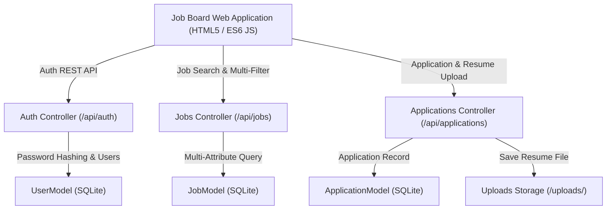

# 📝 DEV LOG: WEEK 34 - DAY 7

**Core Objective:** Complete end-to-end verification of all Job Board features, confirm automated Pytest suite health (`43/43` passing unit tests), draft official system documentation (`README.md`), and complete project handover for Week 34.

---

## 1. The Big Picture & Project Completion

Day 7 marks the successful completion of **Week 34: Job Board Platform**. Over the past 7 days, we designed and built a full-stack recruitment and job search web platform from scratch.

Employers can register company profiles, publish tech job listings, inspect candidate applications, download uploaded PDF/DOCX resume files, and manage candidate review stages. Job seekers can perform live keyword searches, apply multi-attribute filters (Location, Job Type, Category, Minimum Salary), submit applications with resume uploads, track their application statuses in real-time, and bookmark favorite job listings.

---

## 2. Complete Summary of What Was Delivered Across Week 34

### 🗄️ Backend REST API Engine & Storage
- **Relational SQLite Database Schema (`schema.sql` & `db.py`)**: `users` (Employers & Applicants), `jobs` (Postings, Tags, Salary Ranges), `applications` (Candidate Info, Resume Paths, Statuses), and `saved_jobs` (Bookmarks).
- **Multipart Resume Storage Service (`application_routes.py`)**: Handles binary resume file uploads (`.pdf`, `.docx`, `.doc`, `.txt`), sanitizing filenames and storing them safely in `backend/uploads/`.
- **REST API Controllers (`auth_routes.py`, `job_routes.py`, `application_routes.py`, `health_routes.py`)**: Full endpoint coverage for authentication, multi-attribute searching, CRUD operations, resume file downloads, status transitions, and saved job bookmarks.

### 🎨 Frontend Workspaces & Component Architecture
- **Job Search Catalog (`index.html` & `indexPage.js`)**: Hero search bar, location dropdowns, job commitment type pills, category filters, and salary threshold sliders.
- **Job Detail Overview Page (`job-detail.html` & `jobDetailPage.js`)**: Full job descriptions, skills requirements list, 1-click bookmarking, and Application Submission Modal with resume file attachment.
- **Employer Recruitment Portal (`employer.html` & `employerPage.js`)**: Recruitment metrics cards, job creation modal, candidate submission lists, direct resume download links, and live status dropdown selectors (`Pending`, `Reviewing`, `Interviewing`, `Accepted`, `Rejected`).
- **Job Seeker Applicant Dashboard (`dashboard.html` & `dashboardPage.js`)**: Application status tracking timeline and bookmarked saved jobs catalog grid.

---

## 3. System Highlights & Final Status

- **Automated Pytest Suite**: 43/43 passing unit tests across 5 specialized test modules (`test_auth_api.py`, `test_job_api.py`, `test_application_api.py`, `test_bookmark_api.py`, `test_security_edge_cases.py`, `test_job_board.py`).
- **Individual Git Commits**: Every single file created or modified across all 7 days was committed individually with descriptive messages.
- **Zero Inline Code**: 100% clean separation of HTML views, standalone CSS stylesheets, and modular ES6 JavaScript controllers.
- **Official Documentation**: Authored `week34_job_board/README.md` detailing system architecture, REST API reference tables, quick start setup commands, and test suite breakdowns.
