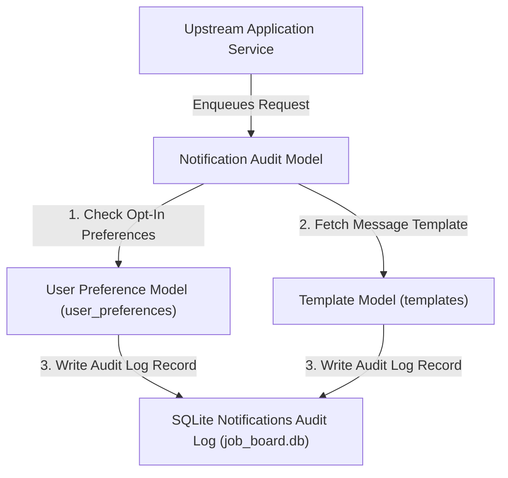

# 📝 DEV LOG: WEEK 35 - DAY 1

**Core Objective:** Scaffold the Week 35 Notification System backend, design SQLite relational database tables (`notifications`, `templates`, `user_preferences`), build data access models, and verify models with automated Pytest unit tests.

---

## 1. The Big Picture & Simple Explanation

On Day 1 of Week 35, our goal was to build the foundation for a multi-channel **Notification System**.

Here is how today's notification architecture works:
1. **Multi-Channel Delivery Support**: Notifications can be dispatched through three distinct communication channels — **Email** (HTML/text messages), **SMS** (text alerts), and **Webhooks** (HTTP event notifications).
2. **Dynamic Notification Templates**: Instead of hardcoding text into code, messages use reusable templates (`templates` table) with placeholders (e.g. `Welcome {{ username }}!`).
3. **User Channel Preferences**: Users can toggle which notification channels they want to receive (`user_preferences` table). If a user turns off SMS alerts, the system automatically respects their preference and skips SMS dispatch.
4. **Idempotency & Audit Logging**: Every notification request is logged in the `notifications` table with status tracking (`Queued`, `Sent`, `Failed`, `Skipped`) and idempotency deduplication keys to prevent accidental double-sending.

---

## 2. Simple Breakdown of What Was Built

### 🗄️ Relational Database Schema (`schema.sql` & `db.py`)
- **`templates` Table**: Stores pre-configured notification templates for Email, SMS, and Webhook channels containing template subjects and variable body strings.
- **`user_preferences` Table**: Stores user opt-in and opt-out preferences (`email_enabled`, `sms_enabled`, `webhook_enabled`).
- **`notifications` Table**: Comprehensive audit log recording idempotency keys, recipient addresses, assigned channel, status, delivery attempts, error messages, and timestamps.

### 🧩 Core Data Models (`notification_model.py`, `template_model.py`, `user_preference_model.py`)
- **`TemplateModel`**: CRUD helper for managing notification templates.
- **`UserPreferenceModel`**: Handles user channel preferences and provides channel opt-in verification helper (`is_channel_enabled`).
- **`NotificationModel`**: Audit logger handling status updates (`Queued` -> `Processing` -> `Sent` / `Failed`), idempotency lookups, and per-user rate-limiting count queries.

---

## 3. Key Takeaways from Today

- **Channel Multiplicity**: Unified data structures handle Email, SMS, and Webhook notifications seamlessly.
- **Privacy & Preference First**: Channel opt-outs are enforced directly at the database preference level.
- **Audit Transparency**: Every notification request is logged with full attempt counts and timestamps!
