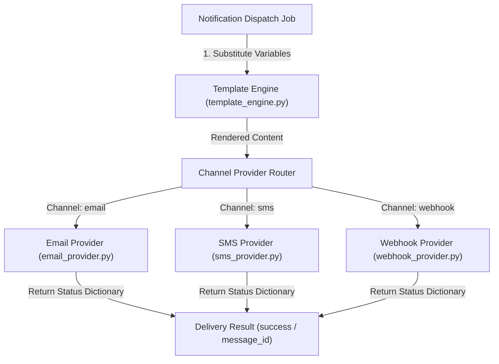

# 📝 DEV LOG: WEEK 35 - DAY 2

**Core Objective:** Implement the abstract base notification provider contract (`base_provider.py`), build multi-channel delivery dispatchers (`email_provider.py`, `sms_provider.py`, `webhook_provider.py`), and build the dynamic Jinja2 template rendering engine (`template_engine.py`).

---

## 1. The Big Picture & Simple Explanation

On Day 2 of Week 35, our goal was to build the delivery engines that actually format and dispatch notifications across different communication channels.

Here is how today's dispatch architecture operates:
1. **Standard Provider Interface**: All notification dispatchers follow the same contract — validating recipient address formats and returning a standard status dictionary (`{ "success": True/False, "message_id": "...", "error": None }`).
2. **Multi-Channel Dispatchers**:
   - **Email Dispatcher**: Validates email addresses (`vee@dev.io`), formats HTML/text headers, and dispatches email alerts.
   - **SMS Dispatcher**: Validates international phone numbers in E.164 format (`+14155552671`) and checks character limits for text messaging.
   - **Webhook Dispatcher**: Validates target HTTP/HTTPS URLs (`https://api.myapp.com/webhook`) and delivers structured event payloads.
3. **Dynamic Template Engine**: Takes raw template text containing placeholders (e.g. `Welcome {{ username }}!`) and dynamically substitutes values passed in variables dictionaries.

---

## 2. Simple Breakdown of What Was Built

### 🛠️ Abstract Base Class & Channel Providers
- **`BaseNotificationProvider` (`base_provider.py`)**: Abstract base class specifying `channel_name()`, `validate_recipient()`, and `send()` methods for all providers.
- **`EmailNotificationProvider` (`email_provider.py`)**: Validates email formats using regex and executes email delivery dispatches with custom subjects.
- **`SMSNotificationProvider` (`sms_provider.py`)**: Validates phone numbers in E.164 format and dispatches SMS text alerts.
- **`WebhookNotificationProvider` (`webhook_provider.py`)**: Validates URL strings and executes HTTP push event dispatches.

### 🎨 Dynamic Template Rendering Engine (`template_engine.py`)
- **Jinja2 Variable Substitution**: Renders placeholders like `{{ username }}` or `{{ company }}` into clean text.
- **Variable Extraction**: Extracts list of required variable names from raw template strings for validation.

---

## 3. Key Takeaways from Today

- **Uniform Provider Contract**: All dispatchers return identical status dictionaries, making result handling clean and modular.
- **Recipient Address Safety**: Every channel validates recipient format before attempting delivery.
- **Dynamic Personalization**: Jinja2 rendering allows rich, personalized message delivery across all channels!
