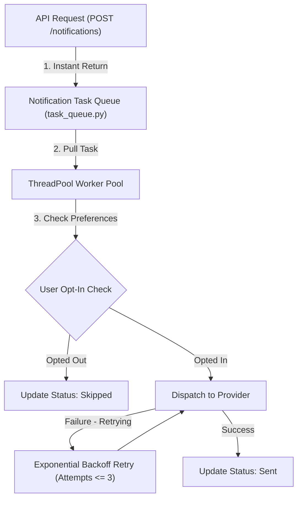

# 📝 DEV LOG: WEEK 35 - DAY 3

**Core Objective:** Implement the thread-safe background task queue (`task_queue.py`), build worker thread pool dispatchers, enforce user channel opt-out preference guards, and implement exponential backoff retries for transient failure recovery.

---

## 1. The Big Picture & Simple Explanation

On Day 3 of Week 35, our goal was to build the background queue engine that processes notification dispatches asynchronously without slowing down web requests.

Here is how today's asynchronous background queue operates:
1. **Instant Response**: When an application sends a notification request, it is instantly added to an in-memory task queue. The web server returns a response immediately (`Status: Queued`) without waiting for network dispatches.
2. **Background Worker Pool**: Worker threads pick up queued notification jobs in the background and route them to their respective channel provider (`Email`, `SMS`, `Webhook`).
3. **Preference Opt-Out Guard**: Before attempting delivery, workers check the recipient's preferences (`user_preferences` table). If the user opted out of SMS alerts, the worker skips delivery and marks the record as `Skipped`.
4. **Exponential Backoff Retries**: If a transient network error occurs during dispatch, the worker retries up to 3 times with exponential delay (`0.4s`, `0.8s`, `1.6s`) before marking a job as `Failed`.



---

## 2. Simple Breakdown of What Was Built

### ⚡ Thread-Safe Asynchronous Queue (`task_queue.py`)
- **`NotificationQueue`**: Thread-safe task queue powered by `queue.Queue()` and `ThreadPoolExecutor(max_workers=4)`.
- **Async Execution Pipeline**: Processes notification jobs in background worker threads without blocking HTTP API callers.

### 🛡️ User Preference Guard & Retry Engine (`task_queue.py` & `worker.py`)
- **Automatic Opt-Out Skipping**: Checks `UserPreferenceModel.is_channel_enabled` before dispatching. If disabled, updates notification status to `Skipped` with explanatory note.
- **Exponential Backoff Retries**: Retries failed dispatches up to 3 times (`Config.MAX_RETRY_ATTEMPTS`) with exponential sleep delays (`time.sleep(0.2 * (2 ** attempts))`).

---

## 3. Key Takeaways from Today

- **Non-Blocking Architecture**: Background worker threads prevent slow email or SMS network calls from blocking web clients.
- **Respectful Notification Delivery**: User channel opt-outs are enforced automatically in the worker pipeline.
- **Resilient Delivery**: Exponential backoff retries ensure transient network glitches don't cause notification failures!
```