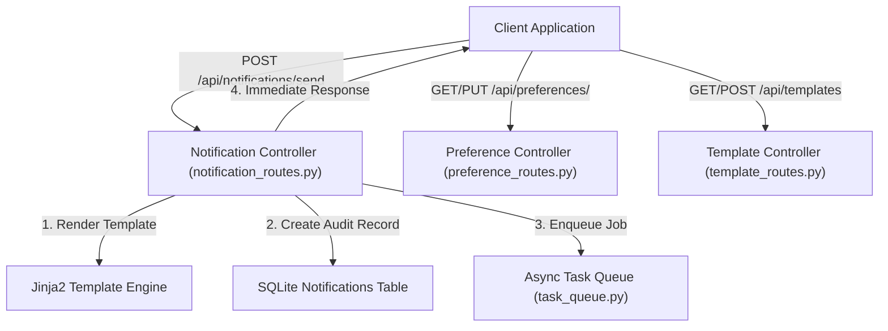

# 📝 DEV LOG: WEEK 35 - DAY 4

**Core Objective:** Build core REST API controllers (`notification_routes.py`, `preference_routes.py`, `template_routes.py`), register route blueprints in the app factory (`app/__init__.py`), and build unit tests for notification dispatching, template creation, and preference management.

---

## 1. The Big Picture & Simple Explanation

On Day 4 of Week 35, our goal was to expose HTTP endpoints so applications can send notifications, manage templates, and configure user channel preferences.

Here is how today's REST API controllers work together:
1. **Notification Dispatch Endpoint (`POST /api/notifications/send`)**: Accepts notification requests specifying user ID, recipient address, channel (`email`, `sms`, `webhook`), template name, and variables. Automatically renders template text, logs an audit record in the database (`Status: Queued`), enqueues the job in the background worker pool, and returns `HTTP 202 Accepted`.
2. **Delivery Status Endpoint (`GET /api/notifications/<id>`)**: Allows clients to check real-time notification delivery status (`Queued`, `Processing`, `Sent`, `Failed`, `Skipped`) and inspect attempt counts and error logs.
3. **User Preferences Endpoints (`GET/PUT /api/preferences/<user_id>`)**: Enables users to view and update their notification channel opt-ins (e.g. enabling Email alerts while disabling SMS alerts).
4. **Template Management Endpoints (`GET/POST /api/templates`)**: Allows administrators to register reusable Email, SMS, and Webhook templates with variable placeholders (e.g. `{{ username }}`).

---

## 2. Simple Breakdown of What Was Built

### 🌐 Notification Controller (`notification_routes.py`)
- **`POST /api/notifications/send`**: Validates request parameters, resolves template placeholders, checks rate limits and idempotency keys, enqueues background worker tasks, and returns `HTTP 202 Accepted`.
- **`GET /api/notifications/<id>`**: Returns delivery audit log, attempt counts, and error details for a given notification.
- **`GET /api/users/<user_id>/notifications`**: Returns recent notification dispatch history for a specific user.

### ⚙️ User Preference Controller (`preference_routes.py`)
- **`GET /api/preferences/<user_id>`**: Returns active user channel opt-ins (`email_enabled`, `sms_enabled`, `webhook_enabled`).
- **`PUT /api/preferences/<user_id>`**: Updates user channel opt-ins and opt-outs.

### 📝 Template Controller (`template_routes.py`)
- **`GET /api/templates` & `GET /api/templates/<name>`**: Lists all registered notification templates or fetches a specific template by name.
- **`POST /api/templates`**: Creates a new notification template with Jinja2 placeholders and channel assignments.

---

## 3. Key Takeaways from Today

- **Non-Blocking REST API**: `POST /send` returns `HTTP 202 Accepted` immediately, delegating heavy provider dispatches to background workers.
- **Dynamic Personalization**: Upstream applications can pass arbitrary variable dictionaries to customize emails or SMS messages.
- **Complete Transparency**: Full delivery status and attempt tracking is accessible via standard REST endpoints!
