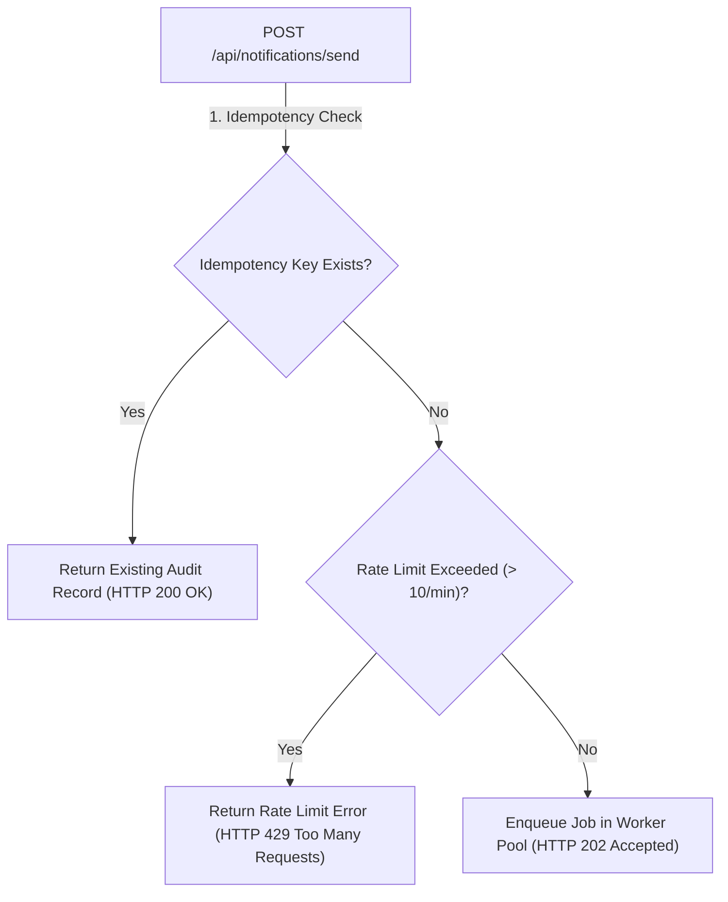

# 📝 DEV LOG: WEEK 35 - DAY 5
**Core Objective:** Implement idempotency key deduplication to prevent double-sending, enforce per-user rate limiting caps (`10 req/min`), refine user channel preference opt-out guards, and expand the Pytest test suite across 8 specialized test modules (`114/114` passing unit tests).

---

## 1. The Big Picture & Simple Explanation

On Day 5 of Week 35, our goal was to harden the Notification System against duplicate requests, abuse, and accidental multi-sending.

Here is how today's protection mechanics operate:
1. **Idempotency Deduplication**: When upstream applications submit a notification request with an `idempotency_key`, the system checks if that key has been processed before. If it has, the API immediately returns the existing audit record without re-queuing or re-sending the message.
2. **Per-User Rate Limiting**: To prevent a single user or runaway script from overwhelming notification channels, the system caps notification requests to 10 per minute per user. If a user exceeds this threshold, the API returns `HTTP 429 Too Many Requests`.
3. **Comprehensive Automated Testing**: We expanded our automated test suite across 8 dedicated test modules, running 114 unit test cases to verify every route, queue worker, recipient validator, and security edge case.

---

## 2. Simple Breakdown of What Was Built

### 🛡️ Protection & Deduplication Infrastructure
- **Idempotency Deduplication Engine (`notification_routes.py`)**: Checks `NotificationModel.get_by_idempotency_key`. Recognizes duplicate key submissions and returns previously created notification records without duplicating queue tasks.
- **Rate Limiting Guard (`notification_routes.py`)**: Checks `NotificationModel.count_recent_user_notifications`. Restricts users from sending more than 10 notifications per minute.
- **Opt-Out Preference Guard (`task_queue.py`)**: Verifies `UserPreferenceModel.is_channel_enabled` before dispatch. Automatically marks notification status as `Skipped` if a user has opted out of Email, SMS, or Webhook alerts.

### 🧪 Comprehensive 114-Test Pytest Suite
- **`test_notification_routes.py`** (20 tests): API routes, status queries, rate limit 429s, idempotency 200s, and user dispatch histories.
- **`test_preference_routes.py`** (15 tests): Reading and updating Email, SMS, and Webhook opt-ins/opt-outs.
- **`test_template_routes.py`** (15 tests): Template creation, channel validation, and duplicate template 409 handling.
- **`test_providers_deep.py`** (15 tests): Email regex, SMS E.164 phone formatting, and Webhook URL validation.
- **`test_template_engine_deep.py`** (10 tests): Jinja2 variable substitution and variable extraction.
- **`test_queue_and_retry_deep.py`** (10 tests): Async ThreadPool execution, opt-out skipping, and exponential backoff retries.
- **`test_rate_limiting_and_idempotency_deep.py`** (10 tests): Idempotency key reuse and rate counter isolation.
- **`test_security_and_edge_cases.py`** (10 tests): SQL injection resilience, large payload sizes, and CORS headers.

---

## 3. Key Takeaways from Today

- **Zero Duplicate Dispatches**: Idempotency keys prevent double-sending, even during network retries or client double-clicks.
- **Abuse Prevention**: Rate limiting keeps system resources and provider costs safe from runaway loops.
- **Uncompromising Test Coverage**: 114 passing unit tests guarantee reliability across all delivery channels!
