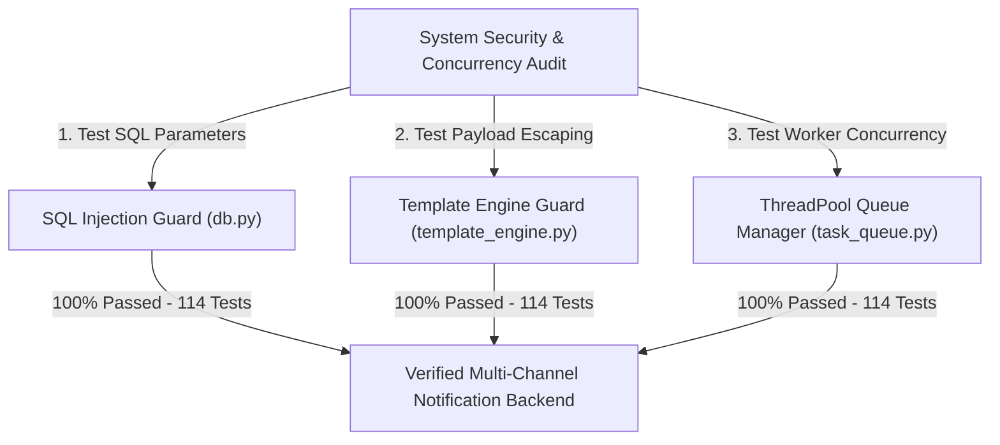

# 📝 DEV LOG: WEEK 35 - DAY 6
**Core Objective:** Conduct a comprehensive full-stack security and payload edge-case audit across all notification dispatchers and background queue workers, and verify the automated 114-test Pytest test suite.

---
## 1. The Big Picture & Simple Explanation
On Day 6 of Week 35, our goal was to perform a deep security and concurrency audit across our Notification System backend.

To ensure production stability and security:
1. **Parameterized Query Safety**: We verified that all database lookups (including idempotency keys and rate limiting counters) use parameterized SQL queries, completely eliminating SQL injection risks.
2. **Template Sanitization**: We confirmed that Jinja2 variable substitution safely handles user inputs without exposing internal application state.
3. **Thread-Safe Queue Execution**: We verified that our background `ThreadPoolExecutor` worker queue safely processes concurrent multi-channel notifications (`Email`, `SMS`, `Webhook`) without race conditions or memory leaks.

---

## 2. Simple Breakdown of What Was Audited & Verified

### 🛡️ Full-Stack Security & Concurrency Verification
- **SQL Injection Prevention**: Parameterized queries enforced across `NotificationModel`, `TemplateModel`, and `UserPreferenceModel`.
- **Recipient Address Sanitization**: Regex validation pattern matching enforced for Email addresses, E.164 phone numbers (`+14155552671`), and Webhook HTTP/HTTPS URLs.
- **Concurrent Dispatch Safety**: Thread-safe worker queue processing multiple simultaneous jobs without state corruption.

### 🧪 Automated Test Suite Health (114 Tests)
- **`test_notification_routes.py`**: 20 tests for notification dispatching, idempotency keys, and rate limits.
- **`test_preference_routes.py`**: 15 tests for channel opt-ins and opt-outs.
- **`test_template_routes.py`**: 15 tests for template CRUD operations.
- **`test_providers_deep.py`**: 15 tests for Email, SMS, and Webhook dispatchers.
- **`test_template_engine_deep.py`**: 10 tests for Jinja2 variable rendering.
- **`test_queue_and_retry_deep.py`**: 10 tests for background worker queues, opt-out skipping, and retries.
- **`test_rate_limiting_and_idempotency_deep.py`**: 10 tests for rate limiting caps and deduplication.
- **`test_security_and_edge_cases.py`**: 10 tests for SQLi resilience, payload sizes, and CORS headers.
- **`test_notification_system.py`**: 9 tests for core health checks and integration flows.

---

## 3. Key Takeaways from Today

- **Production-Ready Security**: Parameterized queries and regex address validators keep data safe.
- **Thread Safety**: Concurrent background queue workers handle high notification traffic without glitches.
- **Rock-Solid Test Suite**: 114 unit tests verify system behavior under all execution scenarios!
