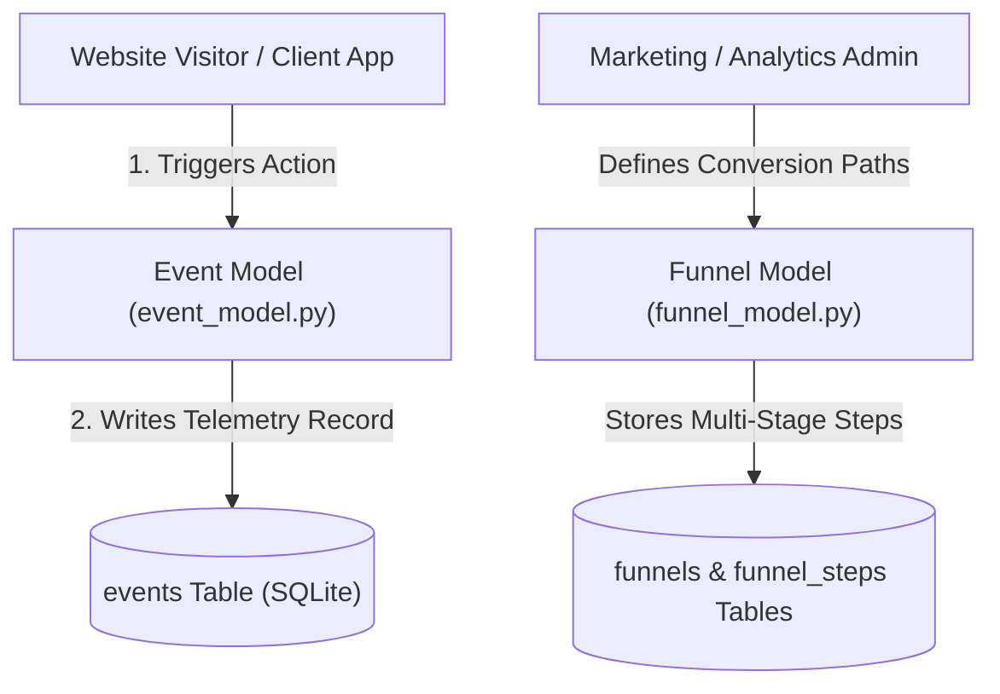

# 📝 DEV LOG: WEEK 36 - DAY 1

**Core Objective:** Initialize the final project of Phase 2 (Week 36 Analytics Dashboard), design the SQLite database schema (`events`, `funnels`, `funnel_steps`), create data models for telemetry ingestion, build JSON serializers, seed 1,000+ realistic demo events, and set up database-isolated Pytest fixtures.

---

## 1. The Big Picture & Simple Explanation

On Day 1 of Week 36, we kicked off the grand finale of Phase 2 by laying the groundwork for a real-time **Analytics & Business Intelligence Dashboard**.

Here is how today's telemetry foundation operates:
1. **Event Telemetry Table (`events`)**: Acts as a digital ledger that records every user interaction on a website — page views, button clicks, user signups, purchases, visitor browsers, device types, and countries.
2. **Conversion Funnels (`funnels` & `funnel_steps`)**: Defines step-by-step visitor journeys (e.g. Landing Page → Product Click → Signup → Checkout Purchase) so the business can track conversion rates and drop-offs.
3. **Database Performance & Isolation**: Configured SQLite with Write-Ahead Logging (WAL mode) and composite indexes on timestamps and session IDs for lightning-fast queries.

---

## 2. Simple Breakdown of What Was Built

### 🗄️ Database Schema & Storage Foundation
- **`schema.sql`**: Creates tables for `events` (Event name, Session ID, User ID, URL path, Referrer, Device type, Browser, OS, Country, Metadata JSON, Created At) and `funnels` / `funnel_steps` with foreign keys and performance indexes.
- **`db.py`**: SQLite connection manager enabling `PRAGMA foreign_keys = ON;` and `PRAGMA journal_mode = WAL;`.
- **`settings.py`**: Centralized configuration management for database file paths and default seed parameters.

### 📦 Data Models & JSON Serialization
- **`event_model.py`**: CRUD helper functions to record events, fetch by ID, count total events, and stream recent live visitor activity.
- **`funnel_model.py`**: Manages conversion funnels and ordered steps for marketing analytics.
- **`serializers.py`**: Converts raw database rows into clean JSON responses with parsed metadata dictionaries.

### 🌐 App Factory, Health Route & Seed Data
- **`__init__.py` & `health_routes.py`**: Flask application factory with CORS support and a `GET /api/health` status endpoint.
- **`seed.py`**: Simulates 1,000+ realistic visitor pageviews, clicks, and purchases across desktop and mobile devices over a 30-day timeline.
- **`run.py`**: Server runner on port `5000` with automatic seed checks.
- **`conftest.py`**: Isolates automated tests to a separate `test_analytics.db` to prevent wiping live development data.

---

## 3. Key Takeaways from Today

- **Flexible Event Structure**: Storing arbitrary JSON metadata alongside core telemetry allows any application to track custom user metrics.
- **Fast Analytics Queries**: Database indexes on `created_at` and `session_id` ensure time-series queries execute in milliseconds.
- **Isolated Testing**: Dedicated test databases prevent test runs from interfering with development data!
