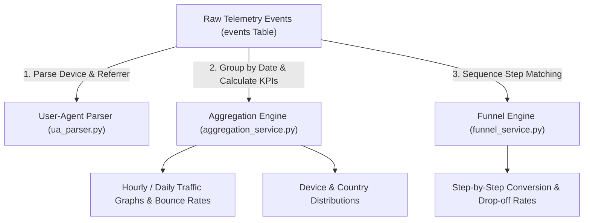

# 📝 DEV LOG: WEEK 36 - DAY 2

**Core Objective:** Build the User-Agent and referrer parser service (`ua_parser.py`), implement the time-series aggregation engine (`aggregation_service.py`) for KPI metric summaries and period growth deltas, create the multi-step conversion funnel calculation engine (`funnel_service.py`), and expand the Pytest test suite to 86 passing unit tests across 5 specialized test modules.

---

## 1. The Big Picture & Simple Explanation

On Day 2 of Week 36, our goal was to build the analytical "brains" of our Analytics Dashboard.

When thousands of raw visitor clicks and pageviews enter a database, raw logs alone are hard to read. Today, we built the engines that turn messy raw logs into meaningful business intelligence:
1. **User-Agent & Device Parser**: Inspects incoming visitor browser strings and instantly determines whether the user is on a Desktop, iPhone, iPad, or Android phone, and categorizes where they came from (Google, Twitter, GitHub, or Direct).
2. **Time-Series Aggregation Engine**: Groups visitor traffic into hourly, daily, or monthly buckets, calculates bounce rates (percentage of visitors who left after viewing only 1 page), and computes growth comparisons (e.g. `+14.2%` pageviews compared to the previous week).
3. **Conversion Funnel Analytics**: Follows visitor journeys step-by-step (e.g. Landing Page → Product Click → Signup → Checkout) to calculate exact conversion rates and pinpoint where users drop off.

---

## 2. Simple Breakdown of What Was Built

### 🔍 User-Agent & Traffic Classifier (`ua_parser.py`)
- **Device & Browser Detection**: Classifies devices (`desktop`, `mobile`, `tablet`), browsers (`Chrome`, `Safari`, `Firefox`, `Edge`, `Opera`), and operating systems (`Windows`, `MacOS`, `iOS`, `Android`, `Linux`).
- **Referrer Categorizer**: Identifies traffic sources (`Search Engines`, `Social Media`, `Developer / Tech`, `Direct`, `Referral`).

### 📈 Time-Series Aggregation Engine (`aggregation_service.py`)
- **`get_overview_metrics`**: Computes Total Pageviews, Unique Visitors (distinct sessions), Bounce Rate percentage, and average pageviews per session.
- **Growth Deltas**: Automatically calculates percentage growth or decline against the previous equivalent time window.
- **`get_timeseries_traffic`**: Groups traffic into custom intervals (`hour`, `day`, `month`).
- **`get_breakdowns`**: Computes percentage share for devices, browsers, operating systems, countries, and referrers.
- **`get_top_pages`**: Ranks top URLs with total views and percentage share.

### 🎯 Multi-Stage Funnel Engine (`funnel_service.py`)
- **`calculate_funnel_metrics`**: Evaluates sequential multi-step conversion funnels, tracking unique session survival across each step and reporting step conversion and drop-off percentages.

### 🧪 Expanded Test Suite (86 Unit Tests)
- **`test_ua_parser_deep.py`** (20 tests): Browser, OS, device, and referrer classification accuracy.
- **`test_aggregation_engine_deep.py`** (20 tests): Bounce rates, hourly/monthly bucketing, date filtering, and period growth deltas.
- **`test_funnel_service_deep.py`** (15 tests): Single-step, multi-step, 100% conversion, and 0% drop-off edge cases.
- **`test_event_model_deep.py`** (15 tests): Event insertion, complex metadata serialization, and Unicode handling.
- **`test_analytics_system.py`** (16 tests): Core integration and health check flows.

---

## 3. Key Takeaways from Today

- **Actionable Insights**: Turning raw click streams into bounce rates, growth deltas, and conversion funnels gives businesses clear visibility into user behavior.
- **Fast SQL Groupings**: Utilizing SQLite's `strftime` and `COUNT(DISTINCT session_id)` allows real-time aggregation queries to execute in milliseconds.
- **Bulletproof Accuracy**: 86 automated unit tests ensure that all percentage math and conversion drop-offs are 100% accurate!
