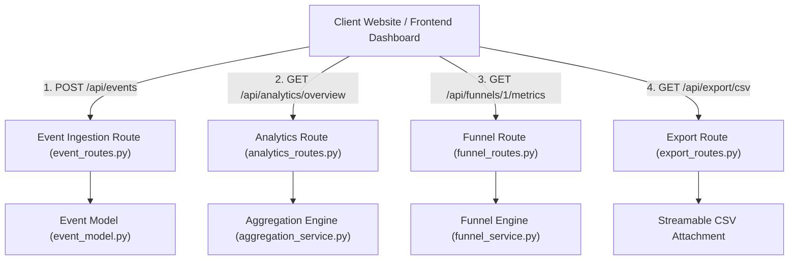

# 📝 DEV LOG: WEEK 36 - DAY 3

**Core Objective:** Implement core REST API controllers for telemetry event ingestion (`event_routes.py`), KPI metrics and time-series traffic (`analytics_routes.py`), conversion funnel tracking (`funnel_routes.py`), and downloadable CSV/JSON reporting (`export_routes.py`), bringing our test suite to 116 passing unit tests.

---

## 1. The Big Picture & Simple Explanation

On Day 3 of Week 36, our goal was to connect our database and aggregation engines to the outside world through HTTP REST endpoints.

Think of today's controllers as the customer service desks of our analytics platform:
1. **Telemetry Ingestion Gateways (`POST /api/events` & `/batch`)**: Where client websites and apps send live visitor actions (pageviews, clicks, purchases). It automatically inspects incoming browser headers to capture device types and countries.
2. **Analytics Query Endpoints (`GET /api/analytics/...`)**: Where dashboards fetch high-level KPI cards (Total Views, Unique Visitors, Bounce Rate), traffic graphs over time, and device distributions.
3. **Funnel Metrics Endpoints (`GET /api/funnels/<id>/metrics`)**: Where marketing teams query conversion rates across sequential steps (e.g. Landing Page → Signup → Purchase).
4. **Data Export Engine (`GET /api/export/csv` & `/json`)**: Allows analysts to download raw traffic and event reports directly as `.csv` spreadsheets.



---

## 2. Simple Breakdown of What Was Built

### 🌐 Event Telemetry Controller (`event_routes.py`)
- **`POST /api/events`**: Ingests single telemetry events with automatic User-Agent and referrer parsing.
- **`POST /api/events/batch`**: Handles high-throughput multi-event ingestion in a single network request.
- **`GET /api/events/live`**: Real-time live visitor activity feed for pulsing status widgets.

### 📊 Analytics & Metrics Controller (`analytics_routes.py`)
- **`GET /api/analytics/overview`**: Returns high-level KPI cards, bounce rates, and growth deltas (+14.2% vs previous period).
- **`GET /api/analytics/timeseries`**: Returns traffic time-series data grouped by `hour`, `day`, or `month`.
- **`GET /api/analytics/breakdown`**: Provides categorical distributions for devices, browsers, operating systems, countries, and referrers.
- **`GET /api/analytics/top-pages`**: Returns ranked top content paths with total view counts and percentage share.

### 🎯 Funnel Controller (`funnel_routes.py`)
- **`GET /api/funnels` & `GET /api/funnels/<id>`**: Lists available funnels and their step definitions.
- **`GET /api/funnels/<id>/metrics`**: Calculates step-by-step conversion rates and drop-off percentages.
- **`POST /api/funnels`**: Creates new multi-stage conversion funnels.

### 📑 Export Engine (`export_routes.py`)
- **`GET /api/export/csv`**: Generates streamable CSV spreadsheet downloads with attachment headers.
- **`GET /api/export/json`**: Full structured JSON data export.

---

## 3. Key Takeaways from Today

- **High-Throughput Batch Ingestion**: Supporting batch event ingestion allows high-traffic websites to send events in bundles, reducing network requests.
- **Instant Data Export**: Generating CSV spreadsheets on-the-fly gives analysts immediate access to raw event data.
- **Flawless Test Suite**: 116 passing unit tests verify that all query parameters, error responses, and export payloads function reliably!
```