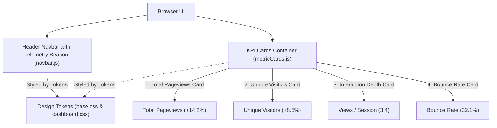

# 📝 DEV LOG: WEEK 36 - DAY 4

**Core Objective:** Establish the frontend architecture for the Analytics Dashboard, design the Dark/Light theme design tokens (`base.css`), create responsive dashboard layout styles (`dashboard.css`), build the API client module (`analyticsApi.js`), construct the brand navbar with live telemetry status (`navbar.js`), and build the primary KPI metric summary cards (`metricCards.js`).

---

## 1. The Big Picture & Simple Explanation

On Day 4 of Week 36, our goal was to lay the visual foundation for our Analytics Dashboard.

Before drawing charts, we built the UI framework and key metric cards:
1. **Design Tokens & Dark/Light Themes**: Configured a cyber/indigo analytical color palette with glassmorphism card surfaces, glowing accent borders, and color-coded delta indicators (green for growth, red for drops).
2. **API Client Module**: A clean JavaScript fetch wrapper that communicates with our Flask REST API to fetch overview metrics, timeseries data, breakdowns, and live visitor streams.
3. **Primary KPI Summary Cards**: Four summary cards positioned at the top of the dashboard displaying:
   - **Total Pageviews** (with percentage comparison vs previous period)
   - **Unique Visitors** (distinct user sessions)
   - **Views per Session** (interaction depth)
   - **Bounce Rate** (percentage of single-page visits)



---

## 2. Simple Breakdown of What Was Built

### 🎨 Design Tokens & Theme Engine (`base.css` & `theme.js`)
- **Theme Palette**: Dark and Light theme variables with accent glows, border tokens, and toast notification styles.
- **Theme Switcher**: Dark/Light mode toggle with `localStorage` state persistence.

### 📐 Dashboard Layout Styles (`dashboard.css`)
- **Responsive Layout**: CSS grid and flexbox rules for toolbar action buttons, KPI summary cards, delta growth badges (`delta-positive` ▲ and `delta-negative` ▼), and two-column panel containers.

### 🔌 Analytics Client API Wrapper (`analyticsApi.js`)
- **Fetch Helpers**: Handles query string generation and network requests for overview stats, timeseries traffic, device breakdowns, top pages, funnels, and CSV downloads.

### 📊 Header Navbar & Metric Cards Component (`navbar.js` & `metricCards.js`)
- **`navbar.js`**: Brand logo, real-time telemetry connection beacon, and theme toggle button.
- **`metricCards.js`**: Renders 4 primary KPI cards with compact number formatting (e.g. `14.2k`, `1.2M`) and color-coded growth badges.

---

## 3. Key Takeaways from Today

- **At-a-Glance Clarity**: Placing the 4 primary KPI cards at the top gives users immediate visibility into overall site health.
- **Dynamic Trend Indicators**: Comparing current metrics against previous periods highlights growth trends at a glance.
- **Modular Frontend Setup**: Separating design tokens, API calls, and UI components ensures clean, maintainable frontend code!
```