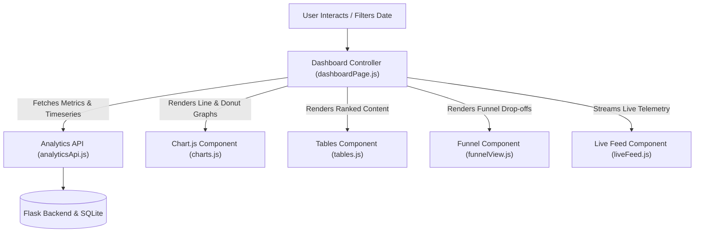

# 📝 DEV LOG: WEEK 36 - DAY 5

**Core Objective:** Build the interactive frontend dashboard for Week 36 using Chart.js traffic area charts and device/browser donut distributions, construct the conversion funnel visualization component (`funnelView.js`), implement the live visitor telemetry activity feed (`liveFeed.js`), and integrate all components into the main dashboard view (`index.html`).

---

## 1. The Big Picture & Simple Explanation

On Day 5 of Week 36, our goal was to turn all the backend data streams and aggregation math into an intuitive, interactive visual command center.

Here is how the dashboard visualizes analytics:
1. **Interactive Traffic Curve (Chart.js)**: Displays daily Pageviews (solid indigo area line) and Unique Visitors (dashed emerald line) with hover tooltips and dynamic date range filtering (Today, 7D, 30D, All Time).
2. **Categorical Donut Breakdowns**: Breaks down traffic by device (Desktop vs Mobile vs Tablet) and browser (Chrome, Safari, Firefox, Edge).
3. **Top Content & Source Tables**: Highlights the most visited URL paths with percentage share progress bars, and categorizes where traffic originated (Search, Social, Developer, Direct).
4. **Conversion Funnel Visualizer**: Shows visitor journeys step-by-step with conversion and drop-off rates.
5. **Live Real-Time Activity Feed**: Streams incoming visitor events in real-time with an active live event counter and a "Simulate Live Event" quick-action button.



---

## 2. Simple Breakdown of What Was Built

### 📈 Interactive Charts & Data Visualizations (`charts.js`)
- **Traffic Area Curve**: Displays smooth pageviews and unique visitor trends with responsive scales and theme-aware gridlines.
- **Device & Browser Donut Charts**: Visual slice distributions for desktop/mobile/tablet and browser market share.

### 🏆 Top Content & Geographic Tables (`tables.js`)
- **Top Pages Table**: Ranks URL paths by view count with unique visitor counts and percentage share progress bars.
- **Referrers & Countries Progress Bars**: Visual progress bars representing top traffic sources.

### 🎯 Funnel Visualizer (`funnelView.js`)
- **Multi-Stage Conversion UI**: Displays step names, event names, visitors reached, step conversion %, and drop-off counts.

### ⚡ Live Telemetry Stream Feed (`liveFeed.js`)
- **Real-Time Activity Stream**: Displays recent visitor actions with event badges (`PAGEVIEW` 📄, `CLICK` 🖱️, `SIGNUP` 👤, `PURCHASE` 💰), device icons, countries, and timestamps.

### 🎛️ Main Dashboard Controller (`dashboardPage.js`)
- Manages date range filtering (Today, 7D, 30D, All Time), funnel dropdown changes, live auto-polling every 3.5s, CSV report downloads, and live event simulations.

---

## 3. Key Takeaways from Today

- **Visual Clarity**: Translating millions of raw data points into line charts, donut distributions, and funnel drop-offs makes metrics instantly understandable.
- **Live Auto-Polling**: Streaming real-time events keeps the dashboard active and engaging.
- **Modular Architecture**: Keeping charts, tables, funnels, and feed components isolated ensures clean, maintainable frontend code!
```