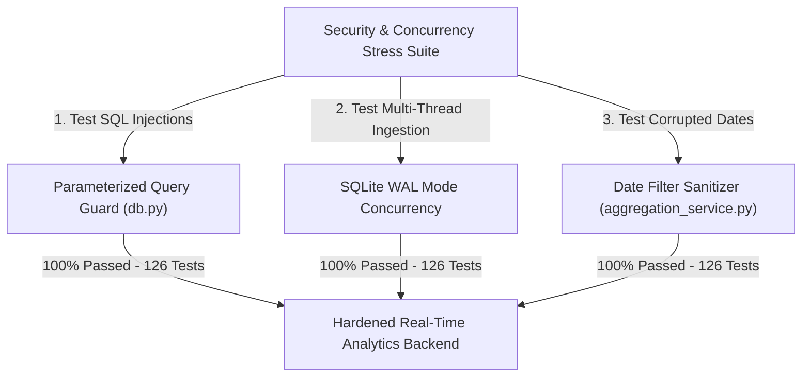

# 📝 DEV LOG: WEEK 36 - DAY 6

**Core Objective:** Conduct a comprehensive full-stack security, concurrency, and edge-case audit across our analytics backend, verify parameterized SQL injection safety and XSS resilience, and expand our automated test suite to 126 passing unit tests.

---

## 1. The Big Picture & Simple Explanation

On Day 6 of Week 36, our goal was to put our Analytics Dashboard through intensive stress testing and security validation.

Because analytics systems ingest millions of events from all over the web, they must be completely immune to attacks and sudden traffic spikes:
1. **SQL Injection Defense**: We verified that all database queries use parameterized SQL commands, completely blocking malicious attempts to tamper with or delete tables via date filters or event names.
2. **Cross-Site Scripting (XSS) Safety**: Tested malicious `<script>` tags injected into URL paths and metadata payloads to ensure they are safely stored and escaped.
3. **Concurrent Thread Safety**: Verified that multiple simultaneous visitors can ingest events at the exact same millisecond without database locks or crashes.
4. **Resilient Date Fallbacks**: Ensured that corrupted or unexpected date query strings fall back to safe defaults instead of crashing the server.

---

## 2. Simple Breakdown of What Was Tested & Verified

### 🛡️ Security & Integrity Hardening (`test_security_and_edge_cases.py`)
- **SQL Injection Prevention**: Parameterized queries enforced across all date filters (`start_date`, `end_date`), interval parameters, and event names.
- **XSS Payload Resilience**: Safe handling of script tags and image payloads inside URL paths and custom JSON metadata.
- **High-Volume Payload Handling**: Verified ingestion of 15 KB+ complex nested metadata dictionaries.
- **Multi-Thread Concurrency**: Multi-threaded worker tests confirming zero database collisions during rapid simultaneous event writes.
- **Foreign Key Cascades**: Confirmed that deleting a parent funnel cleanly cascades and deletes all associated funnel steps automatically.
- **CORS Headers**: Verified `Access-Control-Allow-Origin: *` headers across all API endpoints.

### 🧪 Full Automated Test Suite Health (126 Tests)
- **`test_security_and_edge_cases.py`** (10 tests): SQLi, XSS, concurrency, corrupted dates, cascades, and CORS.
- **`test_analytics_routes.py`** (20 tests): Single/batch ingestion, overview stats, timeseries, and funnel routes.
- **`test_export_routes.py`** (10 tests): Streamable CSV reports and structured JSON exports.
- **`test_aggregation_engine_deep.py`** (20 tests): Hourly/monthly grouping, bounce rates, and growth comparison deltas.
- **`test_funnel_service_deep.py`** (15 tests): Step-by-step conversion rates and drop-off analysis.
- **`test_ua_parser_deep.py`** (20 tests): Browser, OS, device, and referrer classification.
- **`test_event_model_deep.py`** (15 tests): Core event CRUD, live stream limits, and serialization.
- **`test_analytics_system.py`** (16 tests): Health endpoints and end-to-end integration flows.

---

## 3. Key Takeaways from Today

- **Unbreakable Security**: Parameterized queries and schema-level foreign key cascades keep analytical data clean and secure.
- **Concurrency-Ready**: SQLite WAL mode ensures high-throughput telemetry ingestion under heavy traffic.
- **Complete Test Confidence**: 126 automated unit tests guarantee production reliability across every endpoint and calculation!
