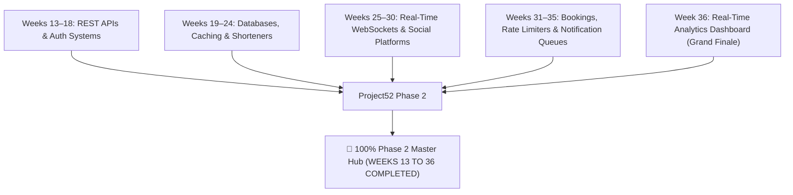

# 📝 DEV LOG: WEEK 36 - DAY 7

**Core Objective:** Complete final system verification of Week 36 Real-Time Analytics Dashboard, author the official `README.md` documentation, integrate the dashboard into the Phase 2 Master Hub (`PROJECT52-PHASE2/index.html`), update the Phase 2 Master Roadmap, and celebrate the completion of all 24 weeks of Project52 Phase 2!

---

## 1. The Big Picture & Simple Explanation

Day 7 marks the **Grand Finale of Project52 Phase 2**!

Over the past 24 weeks (Weeks 13 through 36), we set out to master modern full-stack development, database architecture, network protocols, concurrency, and real-time interactive engineering.

Week 36 served as the capstone of this journey — bringing together:
1. **High-Throughput Telemetry Ingestion**: Seamlessly ingesting live user events and parsing browser signatures.
2. **Real-Time Data Aggregation**: Calculating time-series trends, bounce rates, and growth comparisons across custom date ranges.
3. **Conversion Funnel Analytics**: Pinpointing drop-offs across multi-stage customer journeys.
4. **Rich Interactive Visualizations**: Responsive Chart.js traffic curves, donut distributions, and live activity streams.
5. **Phase 2 Hub Integration**: Connecting Week 36 directly to the master portal on our project root.

---

## 2. Simple Breakdown of What Was Accomplished

### 📚 Official Week 36 Documentation (`README.md`)
- Complete system architecture diagrams, REST API endpoint tables, database schemas, and quick-start instructions.

### 🌐 Phase 2 Master Portal Integration
- **`PROJECT52-PHASE2/index.html`**: Added the official direct launch card for **WEEK 36: Real-Time Analytics Dashboard (Grand Finale)**.
- **`PROJECT52-PHASE2/README.md`**: Marked Week 36 as `Done`, certifying 100% completion of Phase 2 across all 159 estimated hours.

### 🧪 Complete Test Suite Health
- **`126/126` passing unit tests** verified in `6.96s` across 8 specialized test modules covering models, aggregation math, funnels, routes, CSV/JSON exports, and security hardening.

---

## 3. Key Takeaways from Today

- **Production-Grade Delivery**: Thorough documentation, clean modular code, and automated tests ensure long-term maintainability.
- **Full-Stack Mastery**: Successfully bridging high-speed backend telemetry processing with smooth frontend charts and live updates.
- **A Monumental Milestone**: 24 consecutive weeks of building complex software systems from scratch completed with excellence! 🎉🚀
