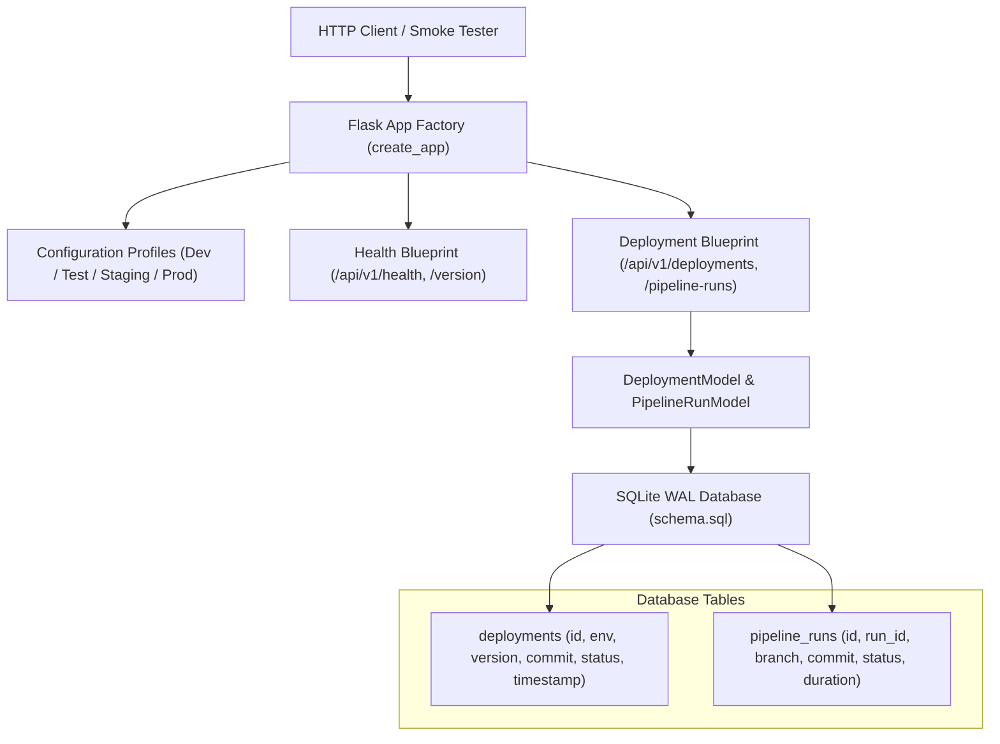

# 📝 DEV LOG: WEEK 37 - DAY 1
**Core Objective:** Engineer the production target application that will serve as the core service for our CI/CD pipeline. Build a modular Flask REST API with multi-environment configuration profiles, SQLite WAL database persistence for deployment audit logging, health and version telemetry endpoints, and a comprehensive baseline unit test suite.

---

## 1. The Big Picture & Simple Explanation

Before you can build an enterprise Continuous Integration & Continuous Deployment (CI/CD) pipeline, you need a real, production-grade application for the pipeline to test, build, and deploy.

Today, we built that core application:
1. **Configurable for Any Environment**: The app knows whether it is running on a developer's machine (`development`), in automated CI tests (`testing`), on a preview server (`staging`), or live for real users (`production`).
2. **Audit Logging & Telemetry**: Every time a deployment or pipeline run occurs, the application records who triggered it, the commit hash, the environment, and its status in a persistent database.
3. **Health & Version Probes**: The app exposes `/api/v1/health` (so uptime monitors and smoke tests know if the server is healthy) and `/api/v1/version` (so we can immediately verify exactly which Git commit is currently running in production).

---

## 2. Simple Breakdown of What Was Built

### ⚙️ Multi-Environment Configuration (`app/config/settings.py`)
- Created inheritance hierarchy: `Config` ➔ `DevelopmentConfig`, `TestingConfig`, `StagingConfig`, `ProductionConfig`.
- Controlled dynamically via `FLASK_ENV`.
- Automatically fetches current git commit hash using `git rev-parse --short HEAD` with fallback to `GIT_COMMIT` environment variable.

### 🗄️ Database & Audit Storage (`data/schema.sql`, `app/db.py`)
- SQLite 3 running in **WAL mode** (Write-Ahead Logging) to allow concurrent reads and fast writes.
- `deployments` table: Stores historical record of all environment deployments with version tags and status.
- `pipeline_runs` table: Tracks CI/CD execution status, branch names, commit hashes, and run durations.

### 📡 Telemetry & Management REST APIs (`app/routes/`)
- `GET /api/v1/health`: Returns server status, database health, and uptime.
- `GET /api/v1/version`: Returns version tag (`v1.0.0`), commit hash, and active environment profile.
- `GET /api/v1/deployments` & `POST /api/v1/deployments`: Queries and records deployment events.
- `GET /api/v1/pipeline-runs` & `POST /api/v1/pipeline-runs`: Queries and records automated pipeline runs.

### 🧪 Baseline Test Suite (`tests/`)
- `conftest.py`: Isolated database fixture guaranteeing zero side-effects between test runs.
- `test_health_and_version.py`: 3 tests verifying health checks, version metadata, and environment profile switching.
- `test_deployment_routes.py`: 6 tests asserting deployment creation, required fields validation, environment filtering, and pipeline run logs.

---

## 3. Key Takeaways from Today

- **Applications Must Be Self-Aware**: Building `/api/v1/version` and `/api/v1/health` into your service from Day 1 makes automated deployment verification (smoke testing) effortless.
- **Isolated Databases in Tests Are Critical**: Always use temporary or in-memory databases in test fixtures (`conftest.py`) so test suites can run repeatedly without corrupting local development data.
- **Strict Single-File Commits**: Committing each file individually maintains a granular, professional git history where every architectural decision is traceable.
