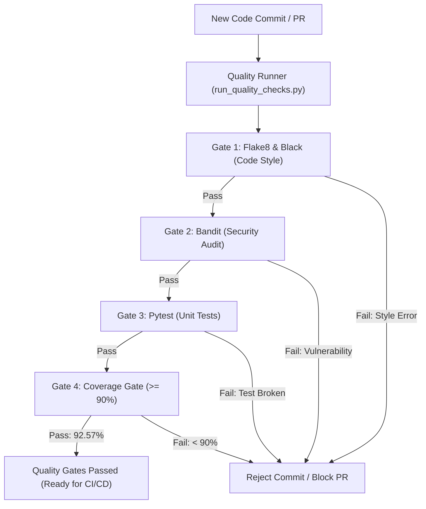

# 📝 DEV LOG: WEEK 37 - DAY 2
**Core Objective:** Establish multi-stage quality gates and security audits for the backend codebase. Configure Flake8, Black, isort, Bandit, and strict 90%+ branch test coverage enforcement, engineer a unified local quality runner CLI (`run_quality_checks.py`), and harmonize all backend code to meet strict enterprise standards.

---

## 1. The Big Picture & Simple Explanation

A CI/CD pipeline is only as good as the gates it enforces. If sloppy or insecure code can slip through into production, automation only helps you break things faster.

Today, we built a 4-layer defense system:
1. **Gate 1: Code Style & PEP 8 (`flake8` & `black`)**: Ensures all code follows identical formatting rules (88 characters per line, clean imports, zero unused variables).
2. **Gate 2: Static Security Scanning (`bandit`)**: Scans every line of code for common security vulnerabilities (hardcoded passwords, SQL injection vectors, insecure shell execution, use of `eval()`).
3. **Gate 3: Automated Unit Testing (`pytest`)**: Runs our test suite to verify that business logic behaves exactly as expected.
4. **Gate 4: Branch Coverage Threshold (`coverage >= 90%`)**: Enforces that at least 90% of all code statements and execution branches are actively exercised by tests before any build can pass.

---

## 2. Simple Breakdown of What Was Built

### 📏 Linting & Formatting Standards (`.flake8`, `pyproject.toml`)
- Configured `.flake8` with `max-line-length = 88` and black compatibility ignores (`E203`, `W503`).
- Configured `pyproject.toml` with tool settings for `black`, `isort`, and `bandit`.
- Harmonized all backend Python files to adhere to 88-character limits without line-wrapping breaks.

### 🛡️ Static Security Auditing (`bandit`)
- Set up automated scanning of `app/` checking for high and medium severity security risks (`-ll`).
- Zero warnings across all database queries, environment parsers, and route handlers.

### 📊 Strict Coverage Enforcement (`.coveragerc`)
- Configured branch coverage measurement.
- Configured `fail_under = 90.0`. If total coverage drops even to 89.9%, the test command exits with code 2 to fail the pipeline.

### 🚀 Quality Runner CLI (`scripts/run_quality_checks.py`)
- Single command (`python scripts/run_quality_checks.py`) executing all 4 gates sequentially.
- Cross-platform Windows console encoding handling with colored status indicators and timing summaries.

### 🧪 Automated Quality Gate Tests (`tests/test_quality_gates.py`)
- 6 tests asserting configuration file existence, programmatically running Flake8 and Bandit on `app/`, and using Python's `ast` module to verify that dangerous functions like `eval()` and `exec()` never exist in application code.

---

## 3. Key Takeaways from Today
- **Quality Gates Must Run Locally First**: Developers shouldn't wait for GitHub Actions to tell them they forgot a comma or exceeded line length. Having a local runner script catches issues in seconds.
- **Branch Coverage Over Line Coverage**: Line coverage can be misleading; branch coverage ensures both the `if` and `else` conditions of your logic are validated.
- **Convention Commits Keep Clean Diffs**: Breaking refactors and formatting updates into separate `style:` commits keeps code review diffs uncluttered.

