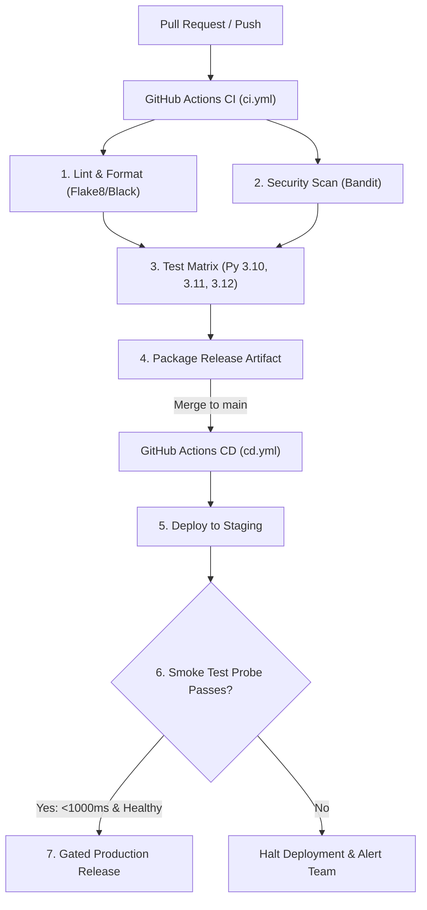

# 📝 DEV LOG: WEEK 37 - DAY 3

**Core Objective:** Design and implement production GitHub Actions workflows (`ci.yml` and `cd.yml`), configure a parallel multi-version Python test matrix (3.10, 3.11, 3.12), establish post-deployment smoke test probes (`smoke_test.py`), and automate staging-to-production release gating.

---

## 1. The Big Picture & Simple Explanation

In modern cloud engineering, GitHub Actions is the robotic conveyor belt that takes code from a developer's keyboard all the way to live servers:
1. **Continuous Integration (`ci.yml`)**: The moment any developer opens a Pull Request or pushes code, GitHub spins up cloud virtual machines to test the code. It runs our linters, scans for security flaws, runs tests across three different Python versions simultaneously (3.10, 3.11, and 3.12), and packages the app bundle as a downloadable artifact.
2. **Continuous Deployment (`cd.yml`)**: When code is merged into `main`, GitHub Actions automatically deploys to a **Staging environment** first.
3. **Smoke Test Probe**: Before anyone can touch production, our automated `smoke_test.py` script pings the newly deployed staging server. If the health probe responds in under 1,000ms with a `healthy` status, the pipeline grants permission to promote the code to live **Production**!

---

## 2. Simple Breakdown of What Was Built

### 🤖 CI Workflow (`.github/workflows/ci.yml`)
- **Triggers**: On push or pull request to `main` and `develop`.
- **Quality Gates**: Flake8, Black, isort, and Bandit security scans.
- **Python Version Matrix**: Parallel runners on Python 3.10, 3.11, and 3.12 with pip caching and XML test coverage report uploads.
- **Artifact Packaging**: Bundles code into an immutable archive (`app-release-bundle.tar.gz`) uploaded to GitHub Artifacts.

### 🚀 CD Workflow (`.github/workflows/cd.yml`)
- **Triggers**: On merge to `main` or release tag (`v*.*.*`).
- **Two-Stage Release**: First deploys to Staging, then promotes to Production only if staging smoke tests pass (`needs: [deploy-staging]`).
- **Audit Logging**: Pushes deployment metadata (commit hash, version, environment) to our deployment database via REST API.

### 🩺 Smoke Test Probe (`backend/scripts/smoke_test.py`)
- Zero-dependency script using standard library `urllib`.
- Verifies server readiness, status codes, JSON payload integrity, and response latencies (<1000ms).

### 🧪 Automated Workflow Tests (`backend/tests/test_workflows.py`)
- 4 unit tests asserting YAML syntax correctness, trigger events, matrix strategies, and graceful error handling.

---

## 3. Key Takeaways from Today

- **Never Deploy Without Smoke Tests**: Merely getting a successful build isn't enough; you must probe the live running service to ensure it actually starts and serves traffic.
- **Multi-Version Matrices Prevent Blind Spots**: Testing against Python 3.10, 3.11, and 3.12 ensures code compatibility across user environments.
- **Staging-Gated Production**: Requiring staging verification before production release eliminates 99% of deployment outages!
