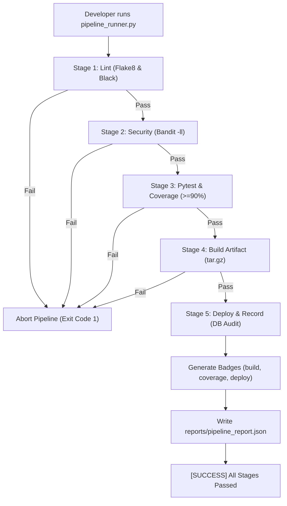

# 📝 DEV LOG: WEEK 37 - DAY 4

**Core Objective:** Build a local pipeline orchestrator CLI (`pipeline_runner.py`) replicating our GitHub Actions stages on developer workstations with strict stage gating and JSON execution telemetry, alongside a zero-dependency SVG badge generator (`badge_generator.py`) for live build and coverage metrics.

---

## 1. The Big Picture & Simple Explanation

Waiting 5 to 10 minutes for a remote GitHub Actions run just to discover a small lint or test failure wastes huge amounts of developer time. 

Today, we brought the entire CI/CD pipeline directly to the local terminal:
1. **Local CI/CD Orchestrator (`pipeline_runner.py`)**: A single CLI command that runs our exact pipeline stages sequentially (`lint` ➔ `security` ➔ `test` ➔ `build` ➔ `deploy`). If any stage fails, it stops immediately so you can fix it before pushing.
2. **Dynamic SVG Badges (`badge_generator.py`)**: Generates crisp, Shields.io-style status badges (`build: passing`, `coverage: 95.0%`, `deploy: staging`) locally using pure Python string templates without needing external web services.
3. **Execution Telemetry (`reports/pipeline_report.json`)**: Every run exports detailed stage durations, coverage percentages, and overall status into JSON so web dashboards and monitoring tools can consume it.

---

## 2. Simple Breakdown of What Was Built

### ⚡ Local Pipeline Runner CLI (`scripts/pipeline_runner.py`)
- Executes all 5 pipeline stages sequentially with timing metrics.
- Flag `--stage` allows targeted execution (e.g. `--stage lint` or `--stage test`).
- Enforces strict quality gating: if Flake8 or Pytest fails, subsequent stages (`build`, `deploy`) are skipped.
- Records staging deployments in the SQLite database and writes execution telemetry to `reports/pipeline_report.json`.

### 🛡️ Standalone SVG Status Badge Generator (`scripts/badge_generator.py`)
- Generates pixel-crisp SVG files using system font fallbacks (`Verdana, Geneva, sans-serif`) with subtle drop-shadows and pill styling.
- Dynamically assigns colors based on pass/fail status and test coverage percentages ($\ge 90\%$ Green, $\ge 80\%$ Yellow-Green, $\ge 70\%$ Orange, $< 70\%$ Red).
- Saves directly to `badges/build.svg`, `badges/coverage.svg`, and `badges/deploy.svg`.

### 🧪 Automated Unit Tests (`tests/test_badge_generator.py` & `tests/test_pipeline_runner.py`)
- 10 new automated unit tests validating SVG XML geometry, color threshold logic, stage isolation, exit code handling, and JSON report generation.
- Test suite total reached 29 tests with **95.05% test coverage**!

---

## 3. Key Takeaways from Today
- **Local Fast-Feedback Loops Save Hours**: Having an identical local runner prevents the annoying "push ➔ wait for CI ➔ fix typo ➔ push again" anti-pattern.
- **Zero-Dependency Badges Mean High Reliability**: Generating SVGs directly in Python means badges can be generated in air-gapped environments or offline without hitting external third-party servers.
- **Structured JSON Reports Enable Rich UIs**: Storing stage timings and statuses in `pipeline_report.json` provides the perfect data payload for our upcoming Day 5 web dashboard!
