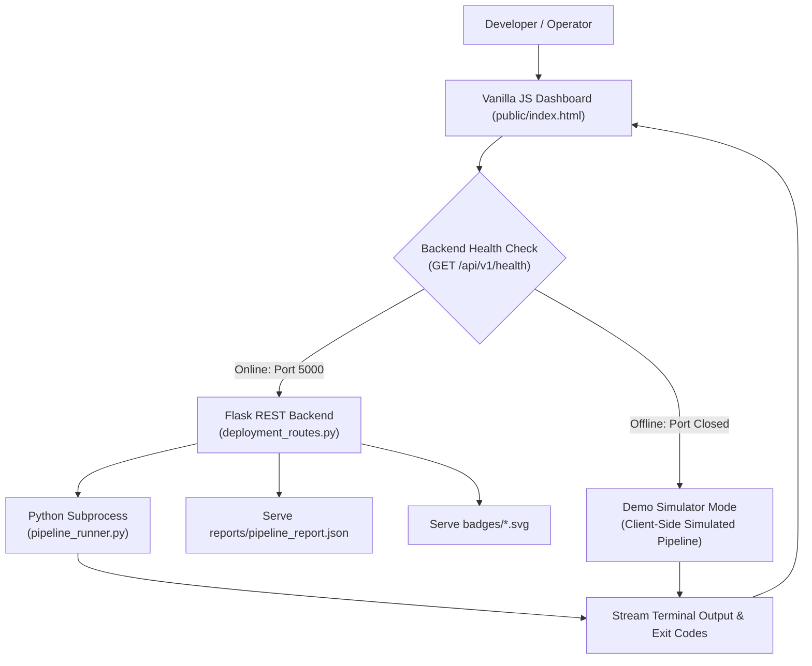

# 📝 DEV LOG: WEEK 37 - DAY 5

**Core Objective:** Build a production-grade, zero-dependency interactive web dashboard (`frontend/`) connecting directly to our Flask CI/CD backend (`deployment_routes.py`), rendering real-time 5-stage pipeline steppers, an ANSI-styled terminal execution log, interactive status badges, deployment audit tables, and seamless offline demo simulation.

---

## 1. The Big Picture & Simple Explanation

In Day 3 and Day 4, we built automated GitHub Actions workflows and a local CLI pipeline orchestrator. While terminal CLIs are great for automation and CI environments, engineering teams need a visual, central mission control:
1. **Visual Pipeline Stepper**: An interactive 5-stage track (`Lint` ➔ `Security` ➔ `Test & Coverage` ➔ `Package Bundle` ➔ `Deploy & Smoke`) with animated progress indicators, real-time pulse states, and pass/fail icons.
2. **Streaming Execution Terminal**: A developer console that streams stdout/stderr stage logs in real-time, complete with stage filter tabs (`All`, `Lint`, `Security`, etc.), line timestamps, and autoscroll.
3. **Interactive Badge Gallery**: Live previews of our zero-dependency SVG badges (`build: passing`, `coverage: 93.0%`, `deploy: staging`) with one-click copyable Markdown, HTML, and URL code blocks.
4. **Dual-Mode Architecture (Live API + Offline Demo Simulator)**: If the backend is running on `127.0.0.1:5000`, the dashboard triggers genuine local subprocess runs and fetches live data from SQLite. If opened standalone without the backend, it automatically switches to a graceful offline demo simulator mode with a clear notice banner.

---

## 2. Key Modules & Features Built

### A. Backend Integration Routes (`app/routes/deployment_routes.py`)
- **`GET /api/v1/pipeline-report`**: Reads and returns the latest JSON telemetry produced by `pipeline_runner.py` (`reports/pipeline_report.json`). If no report exists yet, returns a graceful default structure.
- **`GET /api/v1/badges/<name>`**: Serves generated SVG badges directly from disk with proper `Content-Type: image/svg+xml; charset=utf-8` and `Cache-Control: no-cache` headers, preventing stale browser caching.
- **`POST /api/v1/pipeline/trigger`**: Triggers a local execution of `pipeline_runner.py` with stage filtering (`all`, `lint`, `security`, `test`, `build`, `deploy`) and target environment selection (`staging`, `production`), capturing stage output, duration, and exit codes.

### B. Frontend Architecture (`frontend/src/`)
- **`assets/base.css` & `assets/pipeline.css`**: Production-ready styling featuring modern CSS variables, glassmorphic headers, responsive metric cards, monospace terminal displays, dark/light theme support, and custom-styled scrollbars.
- **`utils/theme.js` & `utils/helpers.js`**: Synchronous theme persistence (`localStorage`), toast notifications, date formatting, and duration formatting.
- **`api/pipelineApi.js`**: Resilient HTTP client that handles REST calls with automatic fallback to simulated pipeline data if the Flask API is unreachable.
- **`components/navbar.js`**: Header with dynamic connectivity beacon (green pulsing beacon for online, amber for offline demo mode), app version, and theme toggle.
- **`components/pipelineStepper.js`**: Interactive 5-stage stepper displaying execution state, duration chips, and click-to-filter stage logs.
- **`components/terminalViewer.js`**: Autoscrolling terminal window supporting stage-specific filtering, log downloads, and color-coded status output.
- **`components/badgeViewer.js`**: SVG badge previewer with copy buttons and dynamic SVG text-width math preventing pill boundary clipping.
- **`components/deploymentTable.js`**: Audit table listing previous deployment runs with environment tags, commit hashes, and status chips.
- **`pages/dashboardPage.js`**: Master orchestrator wiring state management, live triggers, polling intervals, and offline demo banners.

---

## 3. Challenges Encountered & Engineering Solutions
| Challenge                                       | Root Cause                                                                                                                                                                           | Engineering Solution                                                                                                                                                                                                     |
| :---------------------------------------------- | :----------------------------------------------------------------------------------------------------------------------------------------------------------------------------------- | :----------------------------------------------------------------------------------------------------------------------------------------------------------------------------------------------------------------------- |
| **Progress Line Overshooting "Deploy & Smoke"** | The progress bar had `left: 3rem; width: 100%;`. When all stages finished ($100\%$), it shot 48px past the last circle and triggered a massive horizontal scrollbar.                 | Wrapped the line in a dedicated `.pipeline-track-line` bounded strictly between `left: 10%` and `right: 10%` with `overflow: hidden;`, locking the line dead-center inside the 5th circle and eliminating the scrollbar. |
| **Badges Duplicated Text Glitch**               | `` had unescaped double quotes inside an HTML attribute, breaking the HTML parser and dumping raw SVG text onto the page. | Replaced `` with clean native inline SVG rendering (`${b.fallbackSvg}`), making it 100% vector sharp with zero parsing artifacts.                                                                     |
| **Audit Log Timestamps Showing `—`**            | SQLite returns `created_at` in `'YYYY-MM-DD HH:MM:SS'`, but the table looked for `deployed_at` and didn't parse non-ISO SQLite dates.                                                | Updated the table to use `d.deployed_at` and added a safe `parseDate` helper converting SQLite UTC strings to dates (`"Just now"`, `"5m ago"`).                                                                          |
| **Hardcoded Mock Deployments `#1` & `#2`**      | `getMockDeployments()` pre-packaged fake historical rows, making the table show `#3` above `#1` and `#2`.                                                                            | Removed fake dummy entries, starting the table clean with a friendly empty state message, and saved dynamic simulated runs to `sessionStorage` in true `#2`, `#1` order.                                                 |
| **SVG Coverage Text Overflow**                  | Hardcoded SVG right pill width (47px) in the badge generator caused multi-digit percentages (e.g. `92.80%`) to bleed over the green border.                                          | Implemented dynamic proportional SVG width calculation (`Math.max(len * 7.5 + 18, 44)`) and rounded coverage to 1 decimal place (`92.8%`).                                                                               |