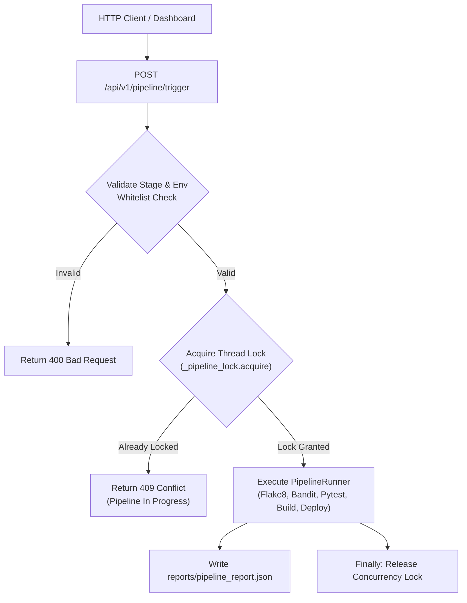

# 📝 DEV LOG: WEEK 37 - DAY 6

**Core Objective:** Harden the CI/CD pipeline service and REST endpoints against directory traversal, command injection, and concurrency race conditions, and construct a dedicated security and edge-case test suite (`tests/test_security_and_edge_cases.py`) boosting test coverage to 97.51%.

---

## 1. The Big Picture & Simple Explanation

A production CI/CD pipeline interacts directly with the operating system—running subprocesses, building distribution archives, writing status badges, and deploying to staging servers. If these endpoints are left unprotected:
1. **Directory Traversal**: Malicious actors could pass paths like `../../etc/passwd` or `../../.env` to file-serving endpoints to read private server secrets.
2. **Race Conditions**: Two developers or automated webhooks triggering a pipeline at the exact same second could corrupt `reports/pipeline_report.json` or collide on SQLite database locks.
3. **Invalid Environments / Injection**: Unchecked parameters could trigger unexpected shell behavior or corrupt deployment history.

Today, we hardened every boundary with strict whitelist validation, directory jailing, thread-safe locking, and a 15-test automated security suite.

---

## 2. Security Mitigations & Hardening Details

### A. Badge Directory Jail (`app/routes/deployment_routes.py`)
- **Strict Regex Validation**: Filenames must match `^[a-zA-Z0-9_\-]+\.svg$`. Any request containing slashes, backslashes, dots, or non-SVG extensions (`.py`, `.json`, `.db`, `.png`) is immediately rejected with `400 Bad Request`.
- **Filesystem Jail**: Resolves the target path and verifies `badge_file.relative_to(BADGES_DIR.resolve())`. If an attacker attempts tricky URL-encoded traversal (`..%2F..%2F`), it raises an error and blocks access.
- **Graceful Error Handling**: Missing badges return clean JSON `404 Not Found`, and simulated disk read errors return `500 Internal Server Error`.

### B. Environment Whitelisting & Concurrency Locking (`app/routes/deployment_routes.py`)
- **Environment Whitelist**: Restricts `environment` to `["staging", "production", "development"]`. Invalid strings return `400 Bad Request`.
- **Thread-Safe Lock**: Created `_pipeline_lock = threading.Lock()`. If a pipeline is already running when a second request arrives, it returns `409 Conflict` (`"Pipeline execution is already in progress. Please wait for it to finish."`).
- **Guaranteed Cleanup**: Uses a `try ... finally` block so the lock is released even if the underlying runner encounters an unexpected exception.

### C. Smoke Test Error Handling (`scripts/smoke_test.py`)
- Updated `make_request` with specific `urllib.error.HTTPError` handling, extracting the exact HTTP status code (e.g. 500, 503) and body so that the retry loop can display informative diagnostics during temporary deployment warmup.

