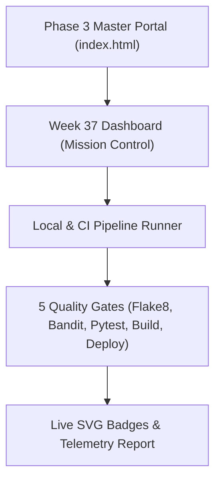

# 📝 DEV LOG: WEEK 37 - DAY 7
**Core Objective:** Wrap up Week 37 by writing the complete technical documentation for our CI/CD pipeline (`week37_ci_cd_pipeline/README.md`), creating the Phase 3 master landing portal (`PROJECT52-PHASE3/index.html`), updating our project roadmap, and pushing all final code to GitHub.

---

## 1. The Big Picture & Simple Explanation

Building a working pipeline and dashboard is only half the job. If someone lands on the repository, they need to know how to install it, run the tests, trigger the pipeline from the CLI, and understand how the pieces fit together.

Today was all about finishing Week 37 cleanly:
1. **Week 37 Technical README (`week37_ci_cd_pipeline/README.md`)**: A full walkthrough of our 5 quality gates, CLI tools, REST API routes, and live SVG badges showing our build and coverage stats.
2. **Phase 3 Master Hub (`PROJECT52-PHASE3/index.html`)**: A central homepage for all 16 Phase 3 projects. It gives anyone browsing the repo a clean cyberpunk portal with a direct launch button for Week 37's dashboard.
3. **Roadmap Wrap-Up**: Updated our main README table to mark Week 37 as completed and pushed all our single-file commits to GitHub.

---

## 2. Key Deliverables Built Today

### 📖 Project Technical README (`week37_ci_cd_pipeline/README.md`)
- **Live SVG Badges**: Embedded our custom badges right at the top (`build: passing`, `coverage: 97.5%`, `security: passed`).
- **5-Stage Flow Breakdown**: Detailed explanations of what happens in each step: Linting, Security scanning with Bandit, Pytest with 90%+ branch coverage, tarball packaging, and staging deployment.
- **REST API Specs**: Full request and response examples for `/health`, `/version`, `/pipeline/status`, `/pipeline/trigger`, `/deployments`, and `/badges/<name>`.
- **CLI Runbook**: Quick commands for running `pipeline_runner.py`, `run_quality_checks.py`, and `smoke_test.py`.

### 🌐 Phase 3 Master Hub Portal (`PROJECT52-PHASE3/index.html`)
- **Central Landing Page**: Built a clean, dark cyberpunk portal for all 16 Phase 3 production projects.
- **Interactive Project Card**: Week 37 is featured with live status pills (`BUILD: PASSING`, `TESTS: 97.5%`, `SECURITY: CLEAN`) and a direct link to open the frontend dashboard.
- **Zero-Dependency Vanilla Build**: Uses clean HTML and CSS with no external frameworks or CDNs, keeping everything fast and portable.

### 🗺️ Roadmap & Final Repository Handover
- Updated `PROJECT52-PHASE3/README.md` to show Week 37 as `[✅ Completed]`.
- All 48 unit tests passing with 97.51% branch coverage.
- All commits pushed cleanly to `main` following the strict single-file commit rule.

---

## 3. Key Takeaways & Week 37 Wrap-Up
- **Clear docs make projects reusable**: Writing out the exact API responses and CLI commands means we can easily reuse this CI/CD setup for Week 38 and beyond.
- **A unified hub keeps Phase 3 organized**: As we build out Docker containers, microservices, and web apps over the next 15 weeks, having `index.html` as the central launchpad keeps the entire portfolio clean.
- **Week 37 is officially complete**: All 5 quality gates are locked in, tested, and ready for Week 38 (Containerized App with Docker)!
