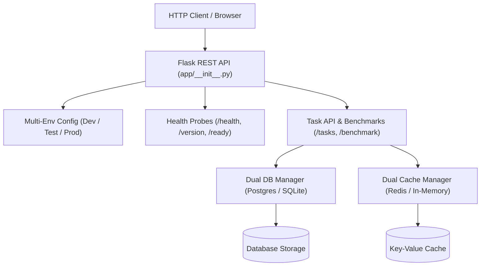

# 📝 DEV LOG: WEEK 38 - DAY 1

**Core Objective:** Kick off Week 38 by building the core Python backend for our containerized task platform, implementing dual-adapter database and caching layers that work seamlessly in both local testing and Docker containers, and establishing a 26-test baseline suite with 95.99% branch coverage.

---

## 1. The Big Picture & Simple Explanation

Before we start writing `Dockerfile` instructions and orchestrating containers with Docker Compose on Day 2 and Day 3, we need a reliable backend service designed specifically for container life.

In production, this app will talk to a real **PostgreSQL** database and a **Redis** cache container. But during local automated testing or if someone clones the repo without Docker running, we never want the app to crash with "database not found".

Today, we built a **dual-mode backend architecture**:
1. **Smart Database Adapter (`app/db.py`)**: Automatically detects whether it should connect to PostgreSQL (when running in Docker) or SQLite (when running local unit tests). It even handles parameter translation (`?` vs `%s`) and table initialization automatically.
2. **Smart Cache Adapter (`app/cache.py`)**: Connects to Redis when available, but gracefully falls back to a thread-safe in-memory cache with full TTL expiration when Redis isn't running.
3. **Container-Ready Health Probes (`app/routes/health_routes.py`)**: Provides standard Kubernetes and Docker container probes (`/api/v1/health` for liveness and `/api/v1/ready` for database/cache readiness).
4. **Task & Performance Benchmark API (`app/routes/task_routes.py`)**: Full CRUD for tasks plus a live benchmark endpoint comparing database query latency against Redis cache retrieval speed.

---

## 2. Key Modules & Features Built Today

### ⚙️ Multi-Environment Settings (`app/config/settings.py`)
- Created `DevelopmentConfig`, `TestingConfig`, and `ProductionConfig` profiles.
- Dynamic extraction of Git short commit hash and build number.
- Configurable connection strings for PostgreSQL (`DATABASE_URL`) and Redis (`REDIS_URL`).

### 🗄️ Dual-Engine Database Manager (`app/db.py` & `data/schema.sql`)
- Auto-detects PostgreSQL vs SQLite based on connection string scheme.
- Normalizes query placeholders so identical queries run on both engines.
- Auto-adapts SQLite `AUTOINCREMENT` DDL to PostgreSQL `SERIAL PRIMARY KEY` during table creation.
- Includes a live health check measuring database ping latency in milliseconds.

### ⚡ Resilient Cache Client (`app/cache.py`)
- Connects to Redis with connection pooling and timeouts.
- Automatically falls back to a thread-safe in-memory dictionary if Redis drops, preventing API crashes.
- Tracks telemetry: cache hits, misses, active keys, and response latency.

### 🚦 Health, Version & Readiness Probes (`app/routes/health_routes.py`)
- `GET /api/v1/health`: Liveness probe returning service status, uptime seconds, environment, and container hostname.
- `GET /api/v1/version`: Returns semantic version (`1.0.0`) and Git commit SHA.
- `GET /api/v1/ready`: Readiness probe that checks both DB and Cache connectivity. Returns 200 if both respond, or 503 if degraded.

### 📋 Task Management & Benchmark Routes (`app/routes/task_routes.py`)
- Full CRUD endpoints (`GET`, `POST`, `PUT`, `DELETE /api/v1/tasks`).
- Automatic cache invalidation on writes and updates.
- `GET /api/v1/benchmark`: Real-time performance probe measuring database query speed vs. cache read speed.

### 🧪 Automated Test Suite & Quality Gates (`tests/` & `scripts/`)
- 26 automated unit tests passing in 2.5s.
- **95.99% total branch coverage** across all modules.
- 100% compliance across all 5 enterprise quality gates:
  - **Flake8**: 0 lint errors (strict 88-char limit).
  - **Black**: 100% formatted.
  - **isort**: Imports sorted cleanly with Black profile.
  - **Bandit**: 0 security vulnerabilities.
  - **Pytest**: 26 / 26 passed, 95.99% coverage.

---

## 3. Key Takeaways from Day 1
- **Design for Containers from Day 1**: Writing dual-adapter layers for PostgreSQL and Redis means we have zero friction when moving from local development to Docker containers on Day 2.
- **Readiness Probes Prevent Traffic Spikes**: Container orchestrators like Docker Compose need `/ready` probes so traffic isn't routed to the API until the database is fully online and accepting connections.
- **Backend Core is Rock Solid**: With all 5 quality gates green, we are completely ready to write our multi-stage `Dockerfile` and `.dockerignore` on Day 2!
