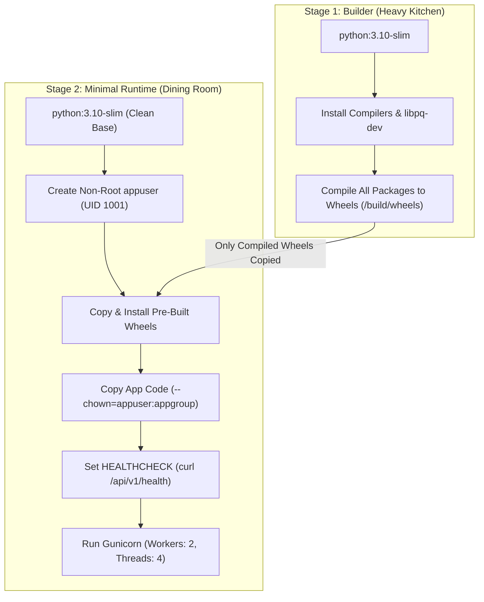

# 📝 DEV LOG: WEEK 38 - DAY 2

**Core Objective:** Package our backend into a secure, multi-stage production Docker image (`python:3.10-slim`), drop container privileges to an unprivileged non-root user (`appuser`), configure native container health checks, and optimize build context with `.dockerignore`.

---

## 1. The Big Picture & Simple Explanation

In Day 1, we built a Python backend with dual adapters for PostgreSQL and Redis. Today was about wrapping that application in a container that is **lean, fast, and secure**.

A common rookie mistake with Docker is throwing everything into a single image. That leaves compilers, build tools, and temporary files lying around—making the image huge and opening up security risks.

To build an enterprise-grade image, we used a **Multi-Stage Build**:
1. **Stage 1: The Builder**: This stage acts like a commercial kitchen. It downloads C compilers and build tools (`build-essential`, `libpq-dev`), resolves all dependencies from `requirements.txt`, and compiles them into clean pre-built Python `.whl` files.
2. **Stage 2: The Runtime**: This stage is the clean dining room. It starts with a fresh, minimal `python:3.10-slim` base, copies only the compiled wheels from Stage 1, and installs them with zero build tools left behind.
3. **Non-Root User for Security**: By default, Docker runs everything as `root`. If a hacker compromises a root container, they could potentially break out to the host. We created an unprivileged system user (`appuser`, UID 1001) and dropped root privileges completely.
4. **Built-In Health Checks**: We baked in a Docker `HEALTHCHECK` directive that pings `/api/v1/health` every 30 seconds. If the server hangs or crashes, Docker automatically marks the container as `unhealthy`.

---

## 2. Key Modules & Files Built Today

### 🐳 Production Multi-Stage Dockerfile (`backend/Dockerfile`)
- **Stage 1 (Builder)**: Upgrades pip, downloads and packages all dependencies and transitive wheels into `/build/wheels`.
- **Stage 2 (Runtime)**: Installs runtime libraries (`libpq5`, `curl`), installs the pre-compiled wheels, and immediately purges wheel artifacts.
- **Unprivileged User**: Drops privileges from root to `appuser` (UID 1001, GID 1001).
- **Production Server**: Runs Gunicorn WSGI with 2 worker processes and 4 threads on port `5000`.
- **Live Verification**: Built the image (`docker-pulse-api:day2`), ran a test container, verified `uid=1001(appuser)`, probed `/api/v1/health` returning 200, and stopped the container cleanly.

### 🚫 Optimized Build Exclusions (`backend/.dockerignore` & `.dockerignore`)
- Blocks heavy directories from entering the Docker build context: `.git/`, `.venv/`, `__pycache__/`, `.pytest_cache/`, `htmlcov/`, test databases, and local `.env` secrets.
- Drastically speeds up build times and prevents secret leaks.

### 📄 Environment Template (`.env.example`)
- Documented all configuration keys for multi-container orchestration: `FLASK_ENV`, `DATABASE_URL` for PostgreSQL, `REDIS_URL` for Redis, and reverse proxy ports.

### 🧪 Automated Dockerfile Standards Suite (`tests/test_dockerfile_standards.py`)
- Added 6 automated tests validating:
  - Multi-stage build syntax (`AS builder` and `AS runtime`).
  - Non-root user creation and `USER appuser` directive.
  - Presence of container `HEALTHCHECK` and `EXPOSE 5000`.
  - Production `gunicorn` invocation.
  - Essential exclusion rules in `.dockerignore`.
  - Valid keys in `.env.example`.
- All **32 tests passing** with **95.99% branch coverage** across all 5 quality gates!

---

## 3. Key Takeaways from Day 2
- **Multi-Stage Keeps Images Trim**: Compiling packages in a dedicated builder stage keeps the final runtime image free of bulky compilers, making downloads and deployments much faster.
- **Always Drop Root in Containers**: Running containers as UID 1001 is a mandatory production security best practice that prevents container escape vulnerabilities.
- **Day 3 is Ready**: With our backend image built, verified, and running under Gunicorn, tomorrow we orchestrate all 4 services (Web, API, Postgres, Redis) with **Docker Compose**!
