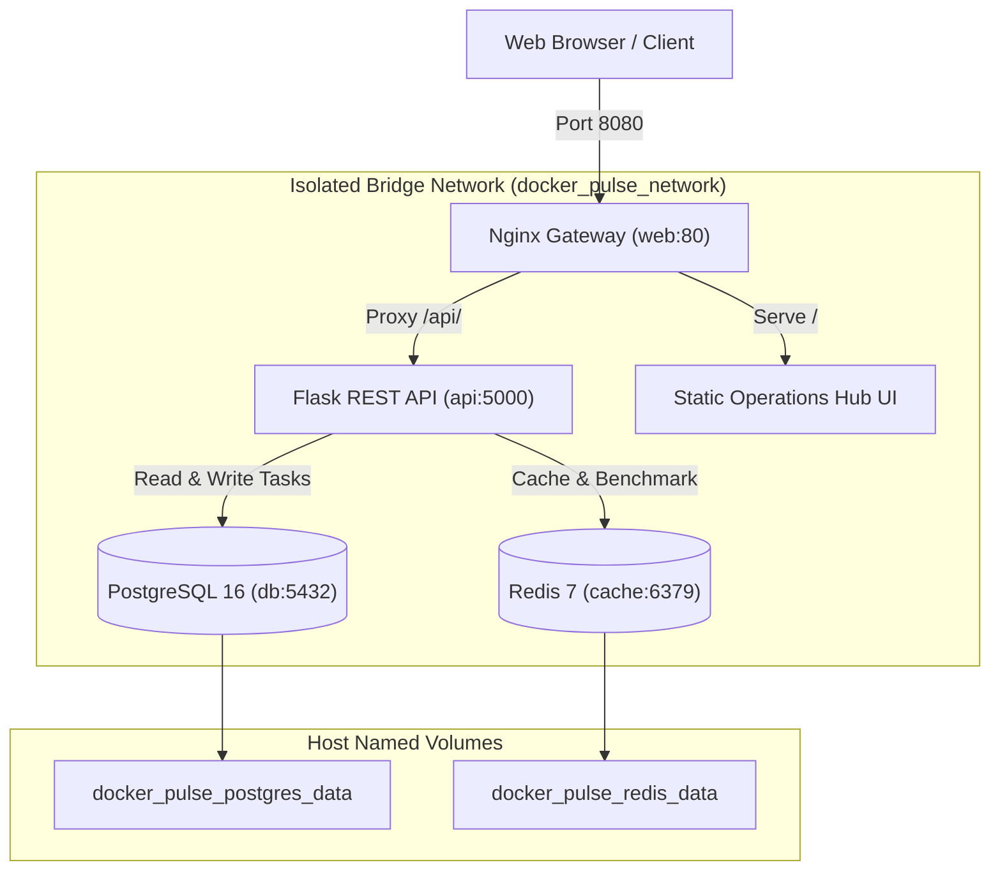

# 📝 DEV LOG: WEEK 38 - DAY 3

**Core Objective:** Wire up a complete 4-tier microservices stack using Docker Compose—orchestrating an Nginx reverse proxy gateway, Flask REST API, PostgreSQL 16 relational database, and Redis 7 cache with health-dependent startup order, named volume persistence, and an isolated bridge network.

---

## 1. The Big Picture & Simple Explanation

In Day 1 and Day 2, we built the backend code and packaged it into a lean, non-root Docker container. But in the real world, an API rarely runs alone. It needs a database to store data permanently, a cache to speed up queries, and a reverse proxy at the front door to handle incoming web traffic.

Manually running 4 separate `docker run` commands and hooking up IP addresses by hand is brittle and painful. That’s where **Docker Compose** comes in:
- **One Blueprint (`docker-compose.yml`)**: We define all 4 services, their networks, their shared volumes, and their environment variables in a single declarative file.
- **Ordered Bootstrapping (`condition: service_healthy`)**: In distributed systems, race conditions are common. If the Flask API boots before PostgreSQL finishes setting up tables, the API crashes. With health checks and `condition: service_healthy`, Docker Compose makes sure Postgres and Redis are completely healthy before launching the Flask API, and waits for the API to be ready before starting Nginx.
- **Safe Internal Network (`docker_pulse_network`)**: Only the Nginx web gateway exposes a port to your machine (`8080`). PostgreSQL, Redis, and Flask talk to each other exclusively inside an isolated Docker internal network using container names as DNS addresses (`db`, `cache`, `api`).
- **Data Persistence (`named volumes`)**: If any container crashes or restarts, your database data and cache logs are safely preserved inside `postgres_data` and `redis_data` volumes on the host disk.

---

## 2. Key Modules & Files Built Today

### 🌐 Nginx Gateway & Reverse Proxy (`nginx/nginx.conf`)
- Configured an enterprise-grade Nginx ingress on port 80 (mapped to host `8080`).
- **Reverse Proxy Routing**: Proxies all `/api/` traffic to the upstream `flask_api` (`api:5000`) while preserving client IP headers (`X-Real-IP`, `X-Forwarded-For`).
- **Gzip Compression**: Compresses text, JSON, CSS, and SVG payloads on the fly for low latency.
- **Direct Liveness Probe**: Provides an instant `/healthz` endpoint (returning `200 OK`) so orchestrators can check proxy health without touching the backend.

### 💻 Operations Hub Frontend (`frontend/public/index.html`)
- Built a standalone dark-themed operations dashboard with zero external CDN dependencies.
- Displays visual service cards for Nginx, Flask, PostgreSQL, and Redis with live direct-action test links.
- Embedded all CSS styles locally to ensure 100% offline compliance and privacy.

### 🔄 Database Connection Retry Resilience (`backend/app/db.py`)
- Added retry resilience and delay handling (`retries=5, delay=1.0s`) to `init_db`.
- Protects the application from startup race conditions during container bootstrapping if Postgres takes an extra second to initialize the database cluster.

### 🐳 Docker Compose Orchestration (`docker-compose.yml`)
- Declared all 4 microservices with explicit health checks:
  - **`db`**: PostgreSQL 16 Alpine with `pg_isready` probe and persistent volume.
  - **`cache`**: Redis 7 Alpine with AOF persistence and `redis-cli ping` probe.
  - **`api`**: Multi-stage Flask container waiting on `db` and `cache` health.
  - **`web`**: Nginx Alpine reverse proxy waiting on `api` health.
- Tested live: All 4 containers spun up cleanly and passed health probes.

### 🧪 Automated Compose & Nginx Test Suite (`backend/tests/test_compose_and_nginx.py`)
- Added 4 automated unit tests verifying:
  - Compose file definitions, services, healthcheck rules, and volume declarations.
  - Nginx configuration directives, upstream blocks, and gzip settings.
  - Frontend compliance with standalone CSS and zero CDN requests.
  - Database initialization retry logic and exception recovery.
- Suite expanded to **36 tests passing** with **95.46% branch coverage** across all 5 quality gates (`flake8`, `black`, `isort`, `bandit`, `pytest`)!

---

## 3. Key Takeaways from Day 3
- **Dependency Ordering Matters**: Using `depends_on` with `condition: service_healthy` eliminates boot crashes and guarantees reliable microservice startups.
- **Defense in Depth**: Isolating databases and internal APIs away from host ports prevents unauthorized direct access; only the reverse proxy should be public-facing.
- **Tomorrow (Day 4)**: We will dive into **Volume Persistence & Secrets Management**, testing database schema migrations, automated volume backups, and secure secret injection!
