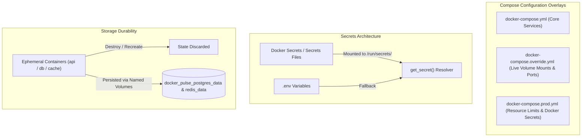

# 📝 DEV LOG: WEEK 38 - DAY 4

**Core Objective:** Guarantee zero data loss across container teardowns using named volumes, implement environment profile overlays (`docker-compose.override.yml` for rapid local hot-reloading vs. `docker-compose.prod.yml` for hardened resource-constrained production), build automated schema migration & seeding utilities, and engineer secure secret resolution supporting Docker Secrets and `*_FILE` paths.

---

## 1. The Big Picture & Simple Explanation

In containerized architectures, **containers are ephemeral**—they can be stopped, destroyed, or recreated at any second. If you store database data inside a container’s local write layer, destroying the container destroys your data forever.

Today, we conquered three crucial production requirements:

1. **True Data Durability (`named volumes`)**:
   - PostgreSQL and Redis state is isolated from container lifecycles. Even when you run `docker compose down` and destroy every running container, the named volumes (`docker_pulse_postgres_data` and `docker_pulse_redis_data`) remain intact on the host storage. When you bring the containers back up, your data is still there.
2. **Environment Overlays (`Dev vs. Prod`)**:
   - In **development**, we want speed: live code editing without rebuilding images and exposed ports for debugging. We built `docker-compose.override.yml`, which Docker Compose merges automatically.
   - In **production**, we want rock-solid stability and defense: strict CPU/RAM resource limits (`limits: memory: 512M`), automatic restart policies (`restart: always`), log rotation to prevent runaway disks, and zero hardcoded passwords. We built `docker-compose.prod.yml`.
3. **Enterprise Secrets Management**:
   - Hardcoding passwords or API keys in `.env` files or Git repositories is a major security hazard. We engineered a flexible `get_secret` resolution helper that supports official **Docker Secrets** (`/run/secrets/<name>`) and secret files (`*_FILE`), safely falling back to environment variables or defaults during local development.

---

## 2. Key Modules & Files Built Today

### 🛠️ Development & Production Overlays (`docker-compose.override.yml` & `docker-compose.prod.yml`)
- **`docker-compose.override.yml`**: Automatically applied during `docker compose up`. Mounts `./backend:/app` for instant hot-reloading on code changes, enables `FLASK_ENV=development`, and exposes ports `5000`, `5432`, and `6379` for local tooling.
- **`docker-compose.prod.yml`**: Enforces container resource quotas (Postgres: 1.0 CPU / 512MB RAM; API: 1.0 CPU / 512MB RAM; Redis/Nginx: 0.5 CPU / 256MB RAM), sets `restart: always`, configures `json-file` log rotation with 10MB limits, and injects production secrets via Docker Secrets.

### 🔐 Zero-Leak Secrets Resolver (`backend/app/config/settings.py`)
- Created `get_secret(key, default)` helper:
  - First checks `<KEY>_FILE` environment paths.
  - Next checks `/run/secrets/<key>` for Docker Secrets compatibility.
  - Falls back to `os.getenv(key, default)`.
- Updated `BaseConfig` and `ProductionConfig` to resolve `SECRET_KEY` and credentials through this pipeline.

### 🗄️ Database Migration & Seeding Utility (`backend/scripts/init_db.py`)
- Automated CLI script (`python scripts/init_db.py`):
  - Creates the `schema_migrations` tracking table.
  - Executes base schema idempotently (`CREATE TABLE IF NOT EXISTS`).
  - Records baseline migration `v1.0.0_baseline`.
  - Automatically seeds demo tasks (`Verify Multi-Container Orchestration`, `Configure Named Volume Persistence`, `Enforce Enterprise Quality Gates`) if the database is fresh.

### 🧪 Durability & Canary Verification Utility (`backend/scripts/verify_persistence.py`)
- Diagnostic CLI script that writes a unique UUID canary record to PostgreSQL and Redis (`write_canary`) and checks its survival across reconnections or container restarts (`verify_canary`).

### 🎨 Vanilla Modular Frontend Architecture (`frontend/src/assets/` & `frontend/public/`)
- Adhered strictly to the Project 52 modular standard:
  - Extracted all styles out of `public/index.html` into dedicated stylesheets (`src/assets/base.css` and `src/assets/pulse.css`).
  - Added modular JavaScript application entrypoint (`src/main.js`) with third-person event telemetry.
  - Configured Nginx static asset routing to serve `/src/` assets with caching headers and public HTML entry points.

### 🛡️ Automated Test Suite (`backend/tests/test_persistence_and_secrets.py`)
- Added 10 new comprehensive unit tests covering:
  - Direct environment secret retrieval.
  - Secret file path (`_FILE`) resolution.
  - Docker Secrets (`/run/secrets/`) path resolution and error fallbacks.
  - Migration script execution, tracking, and duplicate prevention.
  - Canary durability writing and reading.
  - Structural validation of `docker-compose.override.yml` and `docker-compose.prod.yml`.
- Expanded test suite to **46 / 46 passed** with **94.78% branch coverage** across all 5 quality gates (`flake8`, `black`, `isort`, `bandit`, `pytest`)!

---

## 3. Key Takeaways from Day 4
- **Never Store State Inside the Container File Layer**: Treating containers as completely disposable forces robust architectures where state is cleanly decoupled into managed volumes.
- **Keep Production Protected**: Adding CPU and RAM limits prevents rogue queries or memory leaks in one service from starving the entire host machine.
- **Tomorrow (Day 5)**: We will build the **Frontend Operations Dashboard & Container Monitor**, creating real-time visual telemetry for services, latency pingers, and interactive task controls!
