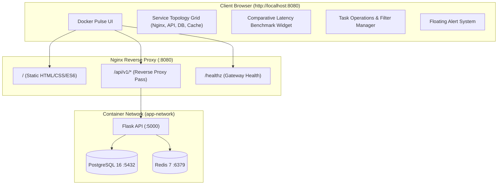

# 📝 DEV LOG: WEEK 38 - DAY 5

**Core Objective:** Design and implement a responsive, lightweight, standalone vanilla ES6 operations dashboard (**Docker Pulse**) to monitor the multi-container stack in real time. The frontend interfaces with the Nginx reverse proxy to visualize service topology, poll database and cache latencies, execute comparative query benchmarks (PostgreSQL 16 relational storage vs. Redis 7 in-memory cache), and provide full task management controls with live cache hit/miss feedback.

---

## 1. The Big Picture & Architectural Overview

A distributed multi-container architecture is only as good as its observability. While logs and command-line health checks provide backend verification, operators require an intuitive, real-time dashboard to assess cluster health, diagnose bottlenecks, and observe caching performance.

On Day 5, the frontend operations layer was engineered adhering strictly to the **standalone vanilla rule** (pure HTML5, CSS3, modern ES6 modules, zero external framework dependencies or CDNs):

### Key Engineering Capabilities Delivered:
1. **Live 5-Second Telemetry Polling**:
   - The dashboard periodically queries `/healthz` on Nginx and `/api/v1/health/ready` on Flask to track ping latencies to PostgreSQL and Redis.
   - Dynamic status badges shift color (emerald for fast `< 5ms`, cyan for normal `< 25ms`, amber for high latency) reflecting live connection response times.
2. **PostgreSQL vs. Redis Comparative Benchmark**:
   - An interactive benchmarking tool executes rapid consecutive reads comparing cold database retrieval against in-memory Redis cache hits.
   - Real-time progress bars dynamically contrast latency differentials (e.g., ~0.8ms Redis in-memory hit vs. ~3.5ms disk round-trip), highlighting a 4x to 8x cache speedup.
3. **Full Task Lifecycle Management**:
   - Real-time task creation form with title, description, priority, and status.
   - Filterable task data table displaying status pills, priority indicators, and creation timestamps.
   - Inline status toggle buttons and instant deletion actions paired with non-blocking toast notifications.
   - Cache telemetry inspection: Inspects `X-Cache` response headers (`HIT` vs. `MISS`) to provide user feedback on cache invalidation and hydration.

---

## 2. Technical Implementation Details

### 📂 Modular Frontend Architecture (`week38_containerized_app/frontend`)
- **`public/index.html`**: Clean, accessible HTML5 document defining semantic application layout, navigation header, topology grid wrapper, benchmark container, and task management sections.
- **`src/assets/base.css`**: CSS custom property design tokens (dark theme palette, spacing scales, typography, and responsive grid layouts).
- **`src/assets/pulse.css`**: Application-specific styling for topology cards, status beacons, benchmark comparison progress bars, task forms, table components, and floating toast notifications.
- **`src/utils/helpers.js`**: Pure utility functions for XSS sanitization (`escapeHtml`), localized timestamp formatting (`formatTimestamp`), and latency threshold badge generation (`getLatencyBadge`).
- **`src/api/opsApi.js`**: Promise-based HTTP client wrapping Nginx gateway health checks (`/healthz`), Flask liveness/readiness probes (`/api/v1/health`), task CRUD operations (`/api/v1/tasks`), and benchmark endpoints.
- **`src/components/toast.js`**: Non-blocking toast notification manager providing contextual feedback for success, error, and info events with auto-dismiss timers.
- **`src/components/serviceGrid.js`**: Component rendering the 4-tier service topology grid (Nginx, API, DB, Cache) with dynamic connection state and ping latency indicators.
- **`src/components/benchmarkCard.js`**: Interactive benchmark runner displaying visual comparison charts and speedup calculations between database and cache queries.
- **`src/components/taskManager.js`**: Complete task lifecycle management component handling task creation, state filtering, inline status updates, and deletions with instant UI refresh.
- **`src/pages/dashboardPage.js`**: Master dashboard controller coordinating component rendering, user interactions, and 5-second background health telemetry polling.
- **`src/main.js`**: Application entry point initializing the dashboard once the DOM is fully loaded.

---

## 3. Verification & Quality Gates

### 🛡️ Automated Test Suite (`backend/tests/test_compose_and_nginx.py`)
- Added structural tests asserting that all modular frontend files, stylesheets, and scripts exist and contain required logic.
- Executed full quality check suite (`run_quality_checks.py`):
  - `flake8`: PASSED (0 errors, line-length compliant)
  - `black`: PASSED (100% formatted)
  - `isort`: PASSED (imports cleanly sorted)
  - `bandit`: PASSED (zero security vulnerabilities)
  - `pytest`: PASSED (47/47 passing tests with **94.78% coverage**)

---

## 4. Key Takeaways & Milestones
- **Observability Empowers Reliability**: Giving operators visual confirmation of container health and latency turns abstract container orchestration into tangible system visibility.
- **Decoupled Architecture Wins**: Serving the frontend through Nginx static mounts while proxying API calls cleanly separates concerns and mimics production ingress setups.
- **Week 38 Milestone Complete**: With backend, multi-stage Dockerfile, docker-compose orchestration, data persistence, and frontend dashboard finished, Week 38 represents a complete production-grade containerized platform!\n