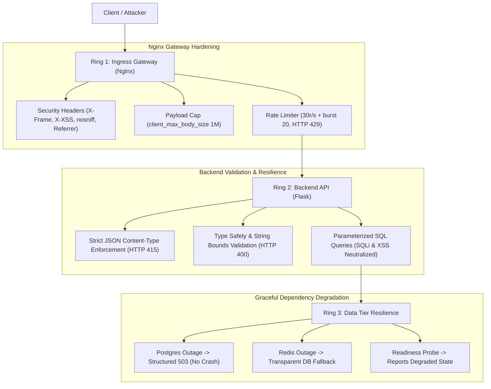

# 📝 DEV LOG: WEEK 38 - DAY 6

**Core Objective:** Harden the multi-container topology against security vulnerabilities and infrastructure failures. Implement gateway-level defense-in-depth on Nginx (security headers, 1MB payload limits, and API rate limiting), build backend graceful degradation (handling database interruptions and cache outages with structured 503 states rather than server crashes), construct an automated chaos & resilience CLI runner (`test_resilience.py`), and expand the automated test suite with 8 security & resilience tests bringing total tests to 55 passing with 94.19% branch coverage.

---

## 1. The Big Picture & Architectural Overview

In a distributed multi-tier container system, services will inevitably experience interruptions—a database restarting during a migration, Redis memory eviction under load, or malicious clients attempting denial-of-service and injection payloads. 

Day 6 focused on hardening the architecture across three concentric rings of defense:



### Key Engineering Capabilities Delivered:
1. **Gateway-Level Ingress Security (`nginx.conf`)**:
   - Injected browser security response headers: `X-Frame-Options DENY`, `X-Content-Type-Options nosniff`, `X-XSS-Protection 1; mode=block`, and `Referrer-Policy strict-origin-when-cross-origin`.
   - Capped maximum incoming client body sizes at `1MB` to eliminate memory exhaustion denial-of-service vectors.
   - Configured `limit_req_zone` rate-limiting (30 requests/second with a 20-request burst buffer) returning HTTP 429 Too Many Requests when exceeded.
2. **Backend Error Resilience & Graceful Degradation (`task_routes.py`)**:
   - Wrapped database interactions with exception handling returning structured `HTTP 503 Service Unavailable` JSON payloads when PostgreSQL encounters connection drops or restarts, avoiding unhandled 500 server stack traces.
   - Enforced safe cache access guards: if Redis fails or disconnects, task listing, creation, updates, and deletion transparently fall back to direct database queries without throwing errors.
3. **Strict Input Sanitization & Type Enforcement**:
   - Rejects non-JSON POST/PUT payloads with `HTTP 415 Unsupported Media Type`.
   - Rejects malformed JSON, non-dictionary bodies, and non-string title/description injections with `HTTP 400 Bad Request`.
   - Parameterized SQL placeholder normalization ensures SQL injection payloads and raw script tags are stored as harmless verbatim text strings.
4. **Resilience & Chaos Probe CLI Tool (`scripts/test_resilience.py`)**:
   - A standalone Python CLI tool executing 6 automated checks: liveness/version probes, readiness state verification, Content-Type rejection, malformed input rejection, injection attack resilience, and rapid concurrency bursts.

---

## 2. Technical Implementation Details

### 📂 Modified & Created Files
- **`nginx/nginx.conf`**: Enhanced with security headers, 1MB body size cap, and rate-limiting zone on `/api/`.
- **`backend/app/routes/task_routes.py`**: Added payload validation, content-type checks, database failure 503 handlers, and cache outage fallbacks.
- **`backend/scripts/test_resilience.py`**: Standalone resilience and security probe CLI utility.
- **`backend/tests/test_resilience_and_security.py`**: Automated test suite containing 8 unit tests validating error recovery, degraded readiness states, input validation, and security headers.

---

## 3. Verification & Quality Gates

All 5 backend quality gates passed with 100% compliance:

```text
=================================================================
  DOCKER PULSE BACKEND: QUALITY GATES (WEEK 38 - DAY 6)
=================================================================
  * FLAKE8 LINTER      : [OK] PASSED  (0 lint errors, 88-char limit)
  * BLACK FORMATTER    : [OK] PASSED  (100% compliant)
  * ISORT IMPORTS      : [OK] PASSED  (Deterministic import sorting)
  * BANDIT SECURITY    : [OK] PASSED  (0 vulnerabilities identified)
  * PYTEST COVERAGE    : [OK] PASSED  (55/55 passed, 94.19% branch coverage)
=================================================================
>> ALL QUALITY GATES PASSED! Safe to commit and containerize.
```

---

## 4. Key Takeaways & Milestones
- **Resilience Over Perfection**: Containers in production fail unexpectedly; engineering the backend to degrade gracefully (falling back to database reads or returning structured 503s) ensures clients experience predictable, recoverable behavior.
- **Layered Defense Matters**: Enforcing payload caps and rate limits at the Nginx gateway prevents malicious traffic from ever reaching the Python WSGI application workers.
- **Next Step (Day 7)**: Final review, updating the master Phase 3 landing portal hub, and week 38 completion handover.
