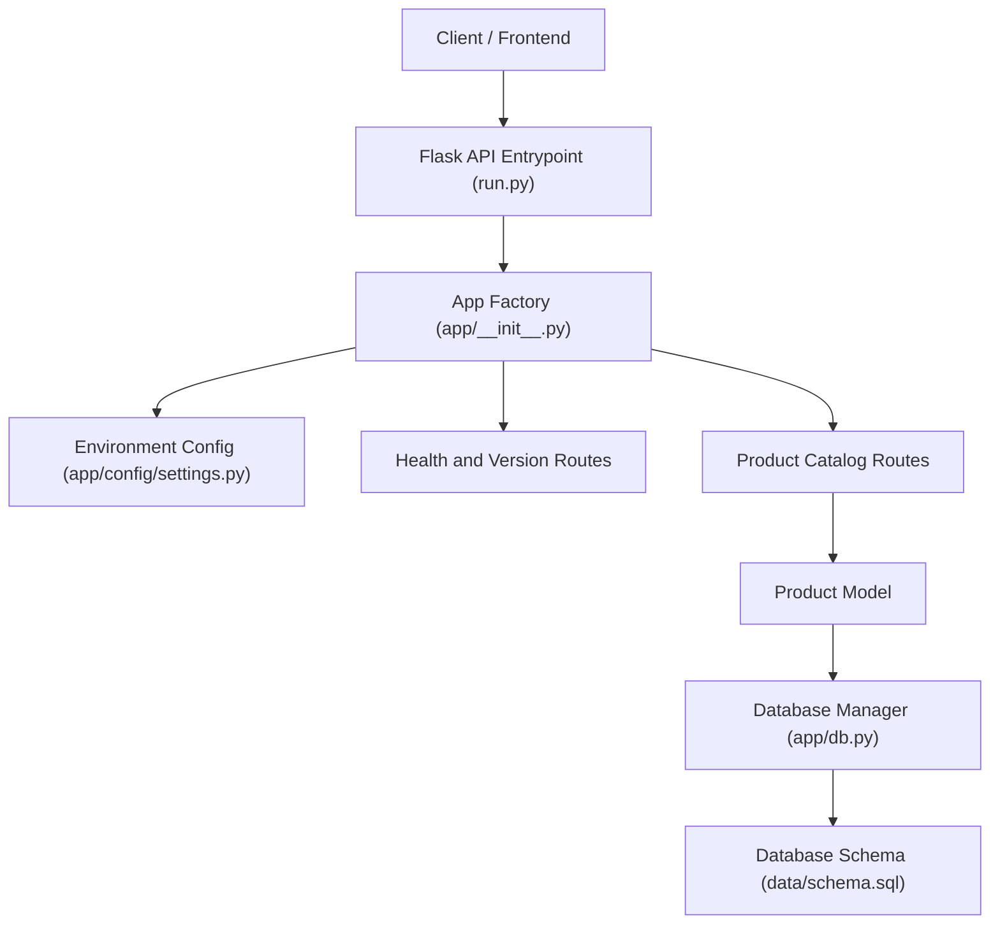

# DEV LOG: WEEK 39 - DAY 1

**Core Objective:** Kick off Week 39 (Production E-Commerce Platform v1 - ShopPulse) by defining the project roadmap, preparing the architectural blueprint, and scaffolding the backend file and directory structure with 19 clean baseline files.

---

## 1. The Big Picture and Simple Explanation

Week 39 focuses on building a production-grade e-commerce application named **ShopPulse**. An online store handles real money and real physical items, meaning that bugs or concurrency errors can lead to overselling stock or losing orders. 

Before writing any business logic, database queries, or payment adapters, we established a strict scaffolding structure. The goal for Day 1 was to map out every single component required for the backend and create the foundational layout.

Every file created today serves a distinct responsibility in the upcoming store architecture:
- Configuration and environment management
- Database connectivity and schema migration
- Data models for catalog items
- Public REST endpoints for health checks and product browsing
- Test automation suites and quality gate runners



---

## 2. Directory Tree Scaffolding Created Today

A total of 19 files across 6 modular packages were scaffolded:

```
week39_ecommerce_store/
└── backend/
    ├── app/
    │   ├── config/
    │   │   ├── __init__.py
    │   │   └── settings.py
    │   ├── models/
    │   │   ├── __init__.py
    │   │   └── product_model.py
    │   ├── routes/
    │   │   ├── __init__.py
    │   │   ├── health_routes.py
    │   │   └── product_routes.py
    │   ├── __init__.py
    │   └── db.py
    ├── data/
    │   ├── schema.sql
    │   └── seed.py
    ├── scripts/
    │   └── run_quality_checks.py
    ├── tests/
    │   ├── __init__.py
    │   ├── conftest.py
    │   ├── test_coverage_boost.py
    │   ├── test_health_and_version.py
    │   └── test_products.py
    ├── requirements.txt
    └── run.py
```

### Purpose of Key Modules

1. **Application Foundation (`run.py`, `app/__init__.py`)**
   - Entry point and factory pattern initialization to enable isolated testing instances without shared global state.

2. **Configuration (`app/config/settings.py`)**
   - Central location for environment variables: ports, database URLs, test keys, and operational modes.

3. **Database Layer (`app/db.py`, `data/schema.sql`, `data/seed.py`)**
   - Connection lifecycle manager, SQLite schema definitions with indexes, and mock seed data generator for testing.

4. **Models & API Routes (`app/models/`, `app/routes/`)**
   - Clean separation of database query logic from HTTP request and response serialization.

5. **Quality Gates & Tests (`scripts/run_quality_checks.py`, `tests/`)**
   - Dedicated scripts for flake8, black, isort, bandit, and pytest execution to enforce consistent code standards.

---

## 3. Key Takeaways and Next Steps

- **Scaffold Before Implementation:** Laying down the entire directory structure beforehand prevents import circularity and architectural drift.
- **Strict Quality Control:** Clean separation of routes, models, and data scripts ensures high maintainability from day one.
- **Ready for Day 2:** With the file layout locked in place and committed to Git, implementation of the catalog schema, product query engine, and baseline test suite can begin directly on Day 2.
