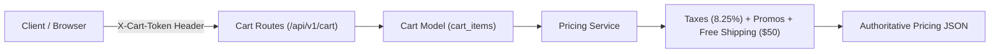

# DEV LOG: WEEK 39 - DAY 3

**Core Objective:** Implement the session-based Cart Engine and authoritative Pricing Service for ShopPulse, featuring cart token persistence, integer cent math, tiered promo code validation, dynamic sales tax, and free shipping threshold calculations.

---

## 1. The Big Picture and Simple Explanation

A shopping cart is more than a list of items—it is a financial calculation engine. If pricing arithmetic is done carelessly, floating-point rounding errors can cause shoppers to be overcharged or undercharged. Even worse, if pricing logic runs in the client browser, malicious users could alter prices in JavaScript before checkout.

Today, we built a server-authoritative cart and pricing engine:
1. **Server-Side Truth:** The frontend never decides what an item costs or how much discount to apply. The client simply asks to add an item ID, and the backend computes all line totals and discounts.
2. **Session Cart Tokens:** Shoppers are identified by a unique `X-Cart-Token` header. This allows guests to maintain a persistent cart across page refreshes without requiring an account or login.
3. **Integer Cent Arithmetic:** All prices, subtotals, taxes, and shipping rates are strictly stored and calculated as integer cents (e.g., $10.00 is `1000`). Floating-point numbers are never used for currency math.
4. **Promo Codes & Shipping Rules:** We introduced promotional discounts (`DISCOUNT10`, `SAVE20`, `WELCOME5`), automated 8.25% sales tax calculation, and free shipping for orders over $50.00.

---

## 2. Key Modules and Features Implemented Today

### Session Cart Management (`app/models/cart_model.py`)
- Created persistent cart session tracking using UUID tokens stored in the `carts` table.
- Added functions to add items, increment/decrement quantities, remove line items, and completely clear the cart.
- Enforced product stock checks during cart additions so customers cannot add more items than available in inventory.

### Authoritative Pricing Service (`app/services/pricing_service.py`)
- Centralized all currency math into pure functions operating strictly on integer cents.
- Built promotional code validator supporting fixed-amount and percentage discounts (`DISCOUNT10` for 10% off, `SAVE20` for 20% off, `WELCOME5` for $5.00 off).
- Implemented estimated sales tax calculation at a flat 8.25% rate.
- Added free shipping threshold logic: orders under $50.00 incur standard $10.00 shipping, while orders at or above $50.00 unlock free shipping.

### Cart API Endpoints (`app/routes/cart_routes.py`)
- `GET /api/v1/cart`: Returns the shopper's active items along with the complete pricing breakdown.
- `POST /api/v1/cart/items`: Adds a product and quantity to the current cart.
- `PATCH /api/v1/cart/items/<id>`: Updates the quantity of a specific cart item.
- `DELETE /api/v1/cart/items/<id>`: Removes a single item from the cart.
- `DELETE /api/v1/cart`: Clears all items from the cart.
- `POST /api/v1/cart/promo`: Validates and applies a coupon code to the session.
- `DELETE /api/v1/cart/promo`: Removes the active promo code.

### Automated Unit Tests (`tests/test_cart.py`)
- Added 13 comprehensive tests covering item additions, quantity updates, out-of-stock rejections, promo code validation, tax math, and free shipping boundaries.
- Maintained quality gate compliance with zero lint or security errors.

---

## 3. Key Takeaways and Next Steps

- **Never Calculate Prices on the Frontend:** Calculating subtotals and discounts strictly on the backend prevents tampering and ensures financial accuracy.
- **Session Tokens Simplify Guest Checkout:** Using a lightweight cart token in headers gives shoppers a persistent cart without forcing them to register an account first.
- **Ready for Day 4:** With the catalog and cart engines in place, Day 4 will implement the Order State Machine, atomic inventory reservations, Stripe payment gateway integration, and webhook handling.
