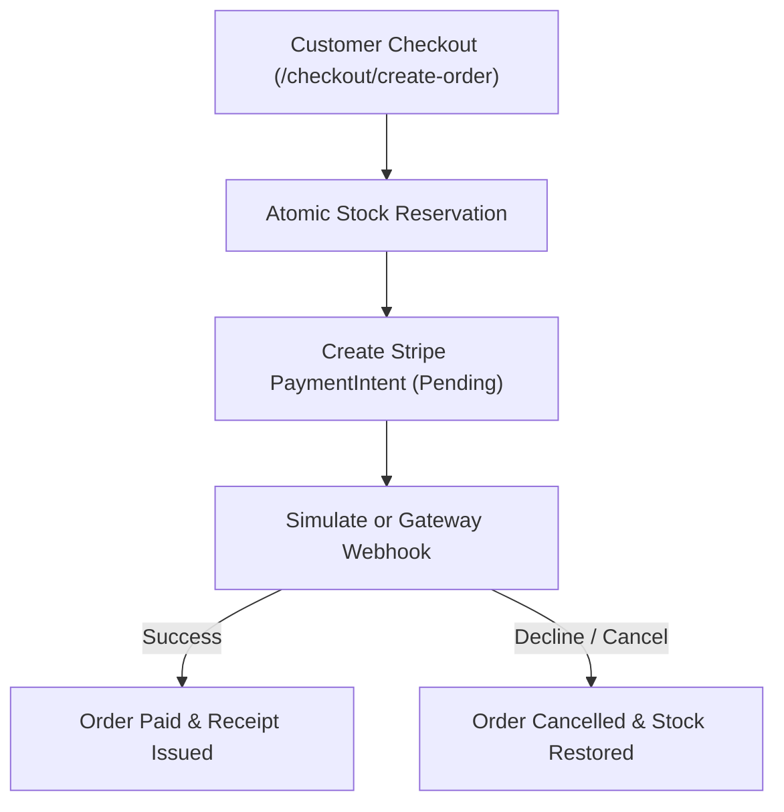

# DEV LOG: WEEK 39 - DAY 4

**Core Objective:** Build the Order State Machine, atomic inventory reservation engine, Stripe payment gateway adapter, HMAC-verified webhook ingestion with idempotency, and automated invoicing for ShopPulse.

---

## 1. The Big Picture and Simple Explanation

Placing an order is the most critical event in an e-commerce platform. If an order fails halfway through payment, inventory might be lost or trapped. If a payment webhook is delivered multiple times by the gateway, the customer could be charged twice or duplicate receipts generated.

Today, we built a robust order processing engine to eliminate these issues:
1. **Atomic Inventory Reservation:** When a customer clicks checkout, the store decrements product stock immediately inside a database transaction. If any item is out of stock, the entire checkout aborts cleanly.
2. **Order Lifecycle State Machine:** Orders strictly follow defined status transitions (`pending` ➔ `processing` ➔ `paid` ➔ `shipped`). If payment fails or is cancelled, reserved stock is automatically returned to inventory.
3. **Stripe Payment Gateway Adapter:** We integrated a payment adapter that creates Stripe-compatible `PaymentIntent` records and supports testing multiple scenarios: successful payment, card decline, and insufficient funds.
4. **Idempotent Webhook Processing:** Stripe delivers webhooks when payments succeed. We record every incoming `event_id` in a database table. If Stripe retries a webhook, the store acknowledges it without reprocessing the order.

---

## 2. Key Modules and Features Implemented Today

### Order Model & State Machine (`app/models/order_model.py`)
- Created `orders` and `order_items` tables capturing customer contact, shipping address, line items, and pricing snapshots.
- Built a strict state transition matrix preventing invalid states (e.g., an order cannot move directly from `cancelled` to `paid`).
- Implemented automatic inventory restoration: if an order is cancelled or refunded, the exact quantities are added back to product stock.
- Created formatted invoice generator compiling transaction IDs, issue dates, and customer details.

### Payment Gateway Adapter (`app/services/payment_service.py`)
- Implemented Stripe-compatible adapter managing `PaymentIntent` lifecycles and client secrets.
- Added payment scenario simulation (`success`, `decline`, `insufficient_funds`) for interactive testing.
- Built cryptographic webhook signature verifier to ensure webhook payloads originate from the authorized payment provider.

### Webhook Event Ingestion (`app/routes/webhook_routes.py` & `webhook_event_model.py`)
- `POST /api/v1/webhooks/stripe`: Ingests payment events (`payment_intent.succeeded`, `payment_intent.payment_failed`).
- Enforced idempotency by recording `event_id` in SQLite with a unique constraint. Duplicate deliveries return HTTP 200 immediately without double-updating orders.

### Order & Checkout Routes (`app/routes/order_routes.py`)
- `POST /api/v1/checkout/create-order`: Initiates order creation and inventory hold.
- `POST /api/v1/checkout/simulate-payment`: Simulates payment processing for testing different gateway responses.
- `GET /api/v1/orders/<order_number>`: Retrieves order details and item breakdown.
- `GET /api/v1/orders/<order_number>/invoice`: Returns a printable invoice summary.

### Automated Unit Tests (`tests/test_orders_and_webhooks.py`)
- Added 11 tests verifying checkout flows, stock reservation, out-of-stock rollbacks, payment failures, webhook idempotency, and invoice generation.

---

## 3. Key Takeaways and Next Steps

- **Always Reserve Stock Before Payment:** Deducting stock before redirecting to payment ensures that a customer never pays for an item that was already claimed by someone else.
- **Idempotency Is Critical for Webhooks:** Payment gateways regularly retry webhook deliveries over unstable networks. Checking for duplicate event IDs prevents duplicate order fulfillment.
- **Ready for Day 5:** With a complete, tested backend handling catalog, cart, orders, and payments, Day 5 will focus on building the responsive Vanilla ES6 frontend storefront.
