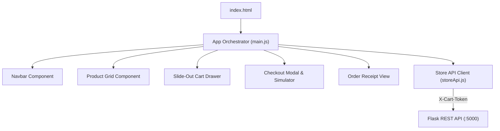

# DEV LOG: WEEK 39 - DAY 5

**Core Objective:** Build the complete, responsive frontend storefront for ShopPulse using modular vanilla ES6 components, unified API client state management, CSS design tokens, and zero external CDN dependencies.

---

## 1. The Big Picture and Simple Explanation

A high-performance e-commerce storefront should feel fast, snappy, and intuitive. Rather than relying on heavy frontend frameworks or downloading megabytes of external dependencies from CDNs, we designed ShopPulse using pure, native web standards (HTML5, modern CSS, and vanilla ES6 modules).

The frontend architecture is organized into reusable components coordinated by a central orchestrator:
1. **Zero External CDN Dependencies:** All styling, resets, and components are bundled locally. The application works reliably regardless of third-party network outages.
2. **Component-Based UI:** The user interface is split into self-contained modules (`navbar`, `productGrid`, `cartDrawer`, `checkoutModal`, `orderSuccess`, and `toast`).
3. **Session-Aware API Client:** An API client (`storeApi.js`) wraps native `fetch`, automatically attaching and persisting the shopper's `X-Cart-Token` in `localStorage`.
4. **Rich E-Commerce Interactions:** Shoppers get an instant debounced search bar, category filter tabs, a slide-out cart drawer with free shipping progress, an interactive checkout modal with payment scenario selection, and a printable order receipt.

---

## 2. Key Modules and Features Implemented Today

### Component Architecture (`frontend/src/components/`)
- **`navbar.js`**: Renders brand identity and dynamic cart count badge with animated bump effects on item additions.
- **`productGrid.js`**: Displays responsive product cards, category tags, stock status badges (In Stock, Low Stock, Sold Out), and Add to Cart action buttons.
- **`cartDrawer.js`**: Slide-out cart drawer featuring quantity steppers, item removal, promo coupon entry, free shipping progress meter, and order cost summary.
- **`checkoutModal.js`**: Form collecting customer name, email, and shipping address, with a scenario selector to test different payment outcomes (`success`, `decline`, `insufficient_funds`).
- **`orderSuccess.js`**: Order summary view displaying transaction references, itemized line items, order status badges, and a 1-click printable invoice button (`window.print()`).
- **`toast.js`**: Lightweight notification system displaying temporary feedback banners for user actions.

### Client State & API Layer (`frontend/src/`)
- **`main.js`**: Coordinates data fetching on boot, handles search input debouncing (250ms), tracks selected category filters, and routes cart and checkout events between components.
- **`api/storeApi.js`**: Centralized HTTP client handling JSON payloads, standardizing error messages, and synchronizing the `X-Cart-Token` header.
- **`utils/helpers.js`**: Utility helpers for currency formatting (`formatCurrency`), XSS protection (`escapeHtml`), and local storage persistence.

### Styling & Design System (`frontend/src/assets/`)
- **`base.css`**: Defines CSS design tokens (color palette, spacing scale, font stacks, and modal z-index hierarchy) with clean dark-mode aesthetics.
- **`store.css`**: Implements component layouts, drawer slide-in transitions, glassmorphic header blur effects, and responsive breakpoints for mobile and desktop screens.

---

## 3. Key Takeaways and Next Steps

- **Vanilla ES6 Is Production-Ready:** For an e-commerce storefront, native ES6 modules and modern CSS provide an exceptionally fast user experience with zero build step complexity.
- **Unified API Client Eliminates Boilerplate:** Centralizing header injection and token storage in `storeApi.js` ensures every component automatically talks to the right cart session.
- **Ready for Day 6:** With the storefront and backend fully integrated, Day 6 will focus on security hardening, database concurrency limits under multi-thread traffic, and automated stress testing.
