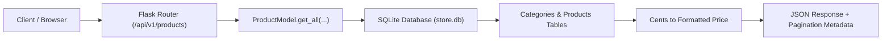

# DEV LOG: WEEK 39 - DAY 2
**Core Objective:** Implement the complete backend core and product catalog engine for ShopPulse, featuring clean relational schema definitions, realistic seed data, search and filtering with pagination, health and readiness probes, and 22 automated tests achieving 98.44% branch coverage.

## 1. The Big Picture and Simple Explanation
An e-commerce store needs a reliable way to show products to shoppers before anything else can happen. Today, we transformed yesterday's empty file scaffolding into a working, tested catalog service.

Instead of writing complicated or generic boilerplate, we kept the architecture straightforward:
1. **Integer Cents Pricing:** Prices are stored as whole cents (for example, `$129.00` is stored as `12900`). This completely avoids floating-point rounding issues when calculating totals, discounts, and taxes later on.
2. **Predictable Query Filters:** Shoppers can filter products by category, sort by price (low-to-high or high-to-low), search by keyword across titles and descriptions, and browse using clean pagination (`limit` and `offset`).
3. **Container-Ready Health Probes:** We added endpoints (`/health`, `/version`, and `/ready`) so that Docker, load balancers, or monitoring scripts can immediately tell if the server is healthy and if the database is responding.
4. **Isolated Automated Testing:** Every unit test spins up an independent SQLite database in memory or temp storage, runs the schema and seed scripts, verifies the response, and cleans itself up automatically.

---

## 2. Key Modules and Features Implemented Today

### Multi-Environment Settings (`app/config/settings.py`)
- Created `DevelopmentConfig`, `TestingConfig`, and `ProductionConfig` profiles.
- Integrated automatic Git commit hash resolution for release tracking.
- Configured dynamic database paths with fallback defaults.

### Database Connection & Schema (`app/db.py` & `data/schema.sql`)
- Built a context-aware connection manager that handles connections per request in Flask and cleanly auto-closes them on teardown.
- Implemented foreign key support with cascading and deletion restrictions.
- Created indexed tables for `categories` and `products` to ensure fast lookups on slugs, categories, and price ranges.
- Added a live `ping_db()` helper that measures real query latency in milliseconds.

### Catalog Seed Dataset (`data/seed.py`)
- Populated 4 distinct categories: Mechanical Keyboards, Studio Audio, Desk Accessories, and Developer Apparel.
- Seeded 12 developer-focused products with realistic pricing in cents, inventory counts, descriptions, and asset paths.
- Built-in `ON CONFLICT` update rules so running the seed multiple times is always idempotent.

### Product Query Engine (`app/models/product_model.py`)
- Handled multi-criteria queries: category slug filtering, case-insensitive keyword search, and sorted outputs (`price_asc`, `price_desc`, `name_asc`, `newest`).
- Clamped pagination limits between 1 and 100 to prevent server memory exhaustion.
- Added inventory stock deduction helpers with checks preventing negative stock.

### REST API Blueprints (`app/routes/product_routes.py` & `health_routes.py`)
- `GET /api/v1/products`: Returns paginated product cards with total matching count.
- `GET /api/v1/products/<slug>`: Returns full product details or a clean 404 response with code `PRODUCT_NOT_FOUND`.
- `GET /api/v1/categories`: Returns category listings along with active product counts.
- `GET /api/v1/health`: Basic liveness check returning uptime and environment.
- `GET /api/v1/ready`: Probes the database connection and returns 200 if connected or 503 if unavailable.

### Automated Testing and Quality Checks (`tests/` & `scripts/`)
- 22 automated test cases covering edge cases, query filters, error handlers (400, 404, 405, 500), and database ping failures.
- Maintained **98.44% branch coverage** across the entire application.
- 100% compliance with strict quality gates: Flake8, Black, isort, Bandit, and Pytest.

---

## 3. Key Takeaways and Next Steps

- **Data Types Matter in Commerce:** Storing prices in integer cents eliminates an entire class of currency math bugs before we even start writing the cart and payment logic.
- **Relational Integrity Early:** Having foreign keys enabled by default prevents orphaned products or invalid category references.
- **Ready for Day 3:** With a fully functional catalog and rock-solid test coverage, Day 3 will focus on building the server-side transactional Cart Engine, item quantity steppers, and pricing calculation logic.
