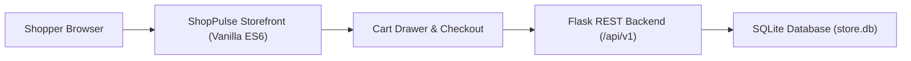

# DEV LOG: WEEK 39 - DAY 7

**Core Objective:** Wrap up Week 39 by fixing frontend storefront bugs, replacing laggy CSS icons with smooth inline SVGs, adding image fallbacks, updating the Phase 3 project portal, and passing all quality checks.

---

## 1. The Big Picture and Simple Explanation

Today was all about finishing touches and bug fixing. While testing the frontend in the browser, we noticed a few issues that needed attention:

1. **Category Tabs Bug:** The category tabs were showing `[object Object]` instead of real category names because the API returned objects instead of plain strings.
2. **Cart Pricing Bug:** The cart drawer showed `$0.00` for subtotal, tax, and total because the frontend was reading top-level fields instead of the server's nested pricing object.
3. **Missing Product Names:** Product cards had missing titles due to a mismatch between `product.name` and the backend's `product.title`.
4. **Browser Lag from CSS Icons:** The earlier pure CSS icons used multiple pseudo-elements and transforms that caused noticeable lag. Replacing them with lightweight inline SVGs made the UI smooth and responsive.
5. **Broken Image Icons:** Since external image files weren't on disk, broken image icons appeared on cards. We added clean category-based SVG placeholders and automatic error handling to keep the storefront looking polished.

---

## 2. Key Modules and Features Implemented Today

### Frontend Bug Fixes
- **Category Tabs:** Fixed `loadCategories()` in `main.js` to read `cat.slug` for filtering and `cat.name` for display text.
- **Cart Calculations:** Updated `cartDrawer.js` and `checkoutModal.js` to read directly from `cart.pricing` so subtotals, discounts, taxes, and totals display accurately.
- **Title and Count Sync:** Corrected product title keys in `productGrid.js` and dynamic cart badges across the navbar and drawer.

### UI Polish and Performance
- **Inline SVG Icons:** Swapped out the heavy CSS icon rules for clean inline SVG icons using `currentColor`, eliminating browser lag completely.
- **Image Fallbacks:** Added themed SVG artwork for each category (`keyboards`, `audio`, `accessories`, `apparel`) and an error listener to gracefully hide broken images.

### Project Handover & Roadmap
- **Technical Documentation:** Wrote a comprehensive `README.md` for Week 39 detailing API routes, architecture, and setup instructions.
- **Phase 3 Portal:** Updated the root landing page (`index.html`) and Phase 3 `README.md`, marking Week 39 as completed (3 of 16 projects done).
- **Quality Checks:** Confirmed all 5 quality checks passed (Flake8, Black, isort, Bandit, and 52 Pytest unit tests with 95.39% coverage).

---

## 3. Key Takeaways and Next Steps

- **Keep Data Contracts in Sync:** Always check that frontend template keys match backend JSON field names exactly (`title` vs. `name`, nested `pricing` vs. flat fields).
- **SVGs Over Complex CSS Hacks:** For icons, inline SVGs are lighter, easier to maintain, and perform significantly better than multi-layered CSS pseudo-elements.
- **Ready for Week 40:** Week 39 is fully complete and working. Next week kicks off **Week 40: Progressive Web App (PWA)** focusing on Service Workers, offline mode, and IndexedDB caching.
