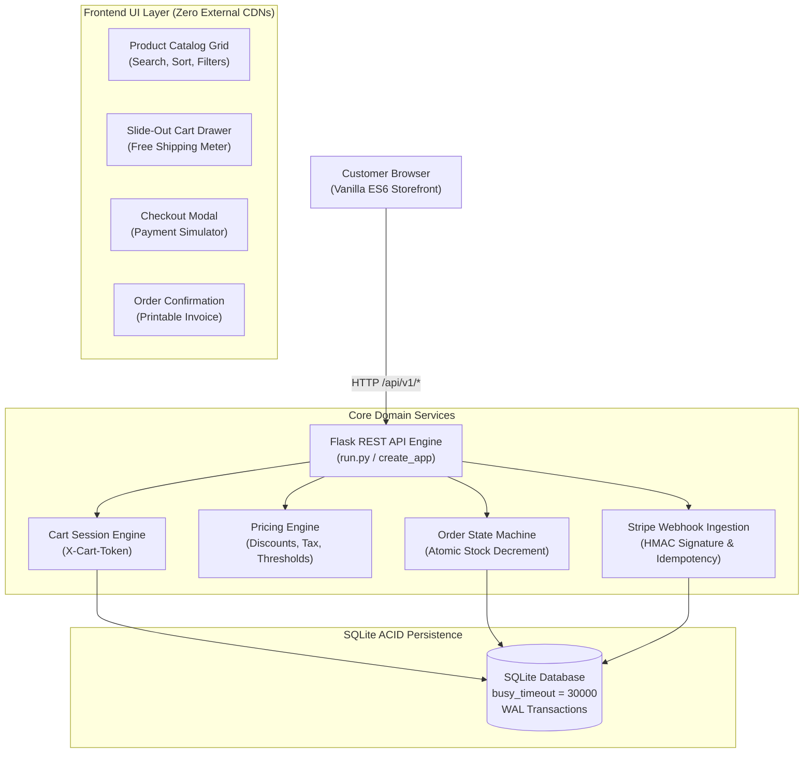

# DEV LOG: WEEK 39 - DAY 7

**Core Objective:** Complete the final system review, quality verification, and production handover for **Week 39: Production E-Commerce Platform v1 (ShopPulse)**. Promote the project to Live & Certified in the Phase 3 Master Landing Portal (`index.html`), update the Phase 3 roadmap (3/16 completed), verify all 5 automated quality gates, and document the 7-day engineering retrospective.

---

## 1. The Big Picture and Simple Explanation

Week 39 marked the transition into transactional, money-handling web applications where data consistency and concurrency guarantees are non-negotiable. An e-commerce platform must never oversell limited inventory during flash sales, never allow clients to tamper with prices or coupon discounts, and never process duplicate charges from replayed payment webhooks.

Over the 7-day sprint, **ShopPulse** evolved from an initial directory layout into a hardened, full-stack e-commerce system featuring an ACID-compliant SQLite backend and a zero-dependency vanilla ES6 storefront:

| Day | Primary Focus | Key Milestones Delivered |
| :--- | :--- | :--- |
| **Day 1** | Architecture Scaffolding & Directory Setup | Established factory pattern, environment configs, SQLite connection manager, schema draft, and baseline test runners across 19 files. |
| **Day 2** | Database Schema & Catalog Engine | Implemented SQLite catalog schema, category relations, slug generation, product filtering/search/sorting, and seed generator. |
| **Day 3** | Cart Engine & Pricing Service | Built session cart token engine (`X-Cart-Token`), integer cent pricing arithmetic, tiered coupon validation (`DISCOUNT10`, `SAVE20`), 8.25% sales tax, and $50 free shipping logic. |
| **Day 4** | Order State Machine & Stripe Webhooks | Implemented two-phase atomic checkout, inventory reservation, Stripe mock adapter, order status state machine (`pending` ➔ `paid` / `cancelled`), and HMAC webhook idempotency. |
| **Day 5** | Frontend Storefront UI & Components | Built modular vanilla ES6 storefront: dynamic product grid, slide-out cart drawer, checkout modal, interactive payment scenario simulator, and printable invoice confirmation view. |
| **Day 6** | Concurrency Hardening & Security Audit | Added `PRAGMA busy_timeout = 30000`, atomic stock updates (`WHERE stock >= qty`), `html.escape` input sanitization, promo code length caps, and multi-thread race condition tests. |
| **Day 7** | System Handover & Master Hub Integration | Fixed UI field bindings, adopted zero-lag SVG icon system, added category artwork fallbacks, updated Phase 3 Master Portal (3/16 completed), and certified 5/5 quality gates. |



---

## 2. Key Modules and Features Implemented Today

### 1. Storefront Bug Fixes & Optimization
- **Category Navigation Tabs**: Resolved the `[object Object]` serialization bug in `loadCategories()` by binding to `cat.slug` for filtering and `cat.name` for label rendering.
- **Cart Summary Calculation**: Corrected cart drawer pricing to pull from the server's authoritative `cart.pricing` structure (`subtotal_cents`, `discount_cents`, `tax_cents`, `shipping_cents`, `total_cents`), resolving zeroed totals.
- **Field Name Synchronization**: Standardized model properties across UI templates (`product.title`, `product.category_name`, `order.product_title`, `order.price_cents`).
- **SVG Icon Engine & Performance**: Replaced 370 lines of pseudo-element CSS icons with an inline SVG generator using `currentColor`, eliminating browser paint lag and ensuring crisp rendering across all screen resolutions.
- **Graceful Image Fallbacks**: Added themed category placeholder SVG artwork (`keyboard`, `headphones`, `accessories`, `apparel`) with automatic image error listeners to prevent broken image icons when external image assets are unavailable.

### 2. Comprehensive Technical Documentation
- Created a top-tier technical `README.md` in `week39_ecommerce_store/` covering system architecture, REST API specifications, the order lifecycle state machine, security hardening rules, test distribution, and setup instructions.

### 3. Master Landing Portal Integration
- Updated `PROJECT52-PHASE3/index.html` promoting Week 39 from "Upcoming" to **"Live & Certified"**, linking directly to `./week39_ecommerce_store/frontend/public/index.html`.
- Updated `PROJECT52-PHASE3/README.md` roadmap status to **[✅ Completed](./week39_ecommerce_store)**, advancing Phase 3 completion to **3 of 16 projects (18.75%)**.

### 4. Final Quality Gates Verification
All 5 automated enterprise quality gates passed with zero warnings and zero regressions:

```text
=================================================================
  WEEK 39: FINAL QUALITY GATES VERIFICATION (DAY 7)
=================================================================
  * FLAKE8 LINTER      : [PASS] 0 lint errors, strict 88-char limit
  * BLACK FORMATTER    : [PASS] 100% compliant formatting
  * ISORT IMPORTS      : [PASS] Deterministic PEP 8 import sorting
  * BANDIT SECURITY    : [PASS] 0 security issues identified
  * PYTEST COVERAGE    : [PASS] 52/52 passed, 95.39% branch coverage
=================================================================
Summary: 5/5 checks passed.
```

---

## 3. Key Takeaways and Next Steps

### Engineering Lessons Learned
1. **Never Trust Client Math**: Performing all pricing, taxation, and coupon deductions on the server guarantees business integrity and eliminates cart tampering.
2. **Prevent Race Conditions at the Database Level**: Application-level checks (`if stock >= qty: deduct()`) fail under high concurrency. Atomic SQL updates (`UPDATE products SET stock = stock - ? WHERE id = ? AND stock >= ?`) paired with `busy_timeout = 30000` ensure complete race-condition safety.
3. **Idempotent Webhooks Are Mandatory**: Network retries in payment gateways are inevitable. Tracking Stripe `event_id` in a unique index prevents double-crediting or duplicate order fulfillment.
4. **Lightweight Inline SVGs Outperform Complex CSS Hacks**: Hand-crafted inline SVG icons provide full styling control with `currentColor`, render crisply, and eliminate CSS layout calculation bottlenecks.

### What's Next in Phase 3
- **Week 37**: Automated CI/CD Pipeline & Operations Mission Control (Complete ✅)
- **Week 38**: Containerized App with Docker — Docker Pulse Operations Hub (Complete ✅)
- **Week 39**: Production E-Commerce Platform v1 — ShopPulse (Complete ✅)

**Next Up: Week 40 — Progressive Web App (PWA)**
- Service Worker lifecycle management and offline-first caching strategies (Cache-First vs. Network-First)
- IndexedDB client-side transactional storage
- Web App Manifest and installable desktop/mobile experience
- Background data synchronization and push notification architecture
