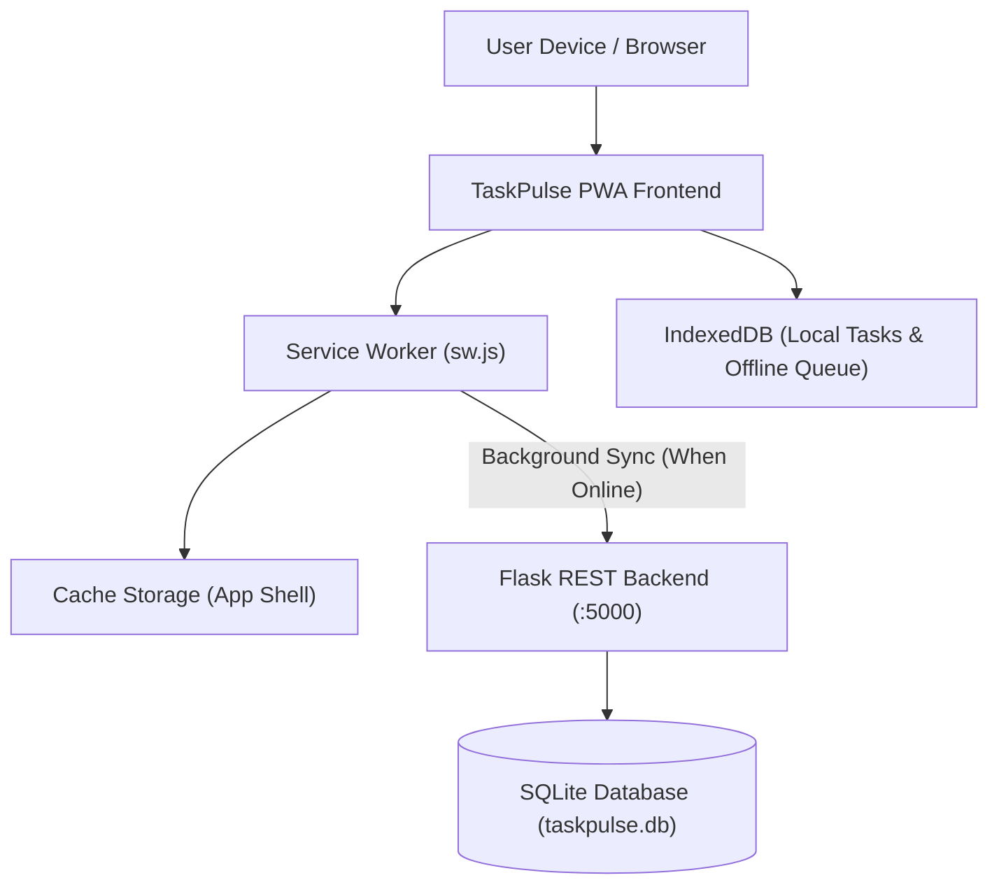

# DEV LOG: WEEK 40 - DAY 1

**Core Objective:** Kick off Week 40 (Progressive Web App - TaskPulse) by designing the offline-first architecture, planning the 7-day implementation roadmap, and scaffolding the complete backend and frontend directory layout with 38 clean baseline files.

---

## 1. The Big Picture and Simple Explanation

A Progressive Web App (PWA) bridges the gap between web applications and native mobile or desktop software. Traditional web apps show a blank screen or a dinosaur error when the user loses internet connection. A production PWA, by contrast, loads instantly in any network condition, works completely offline, and can be installed directly to the home screen or taskbar without an app store.

This week, we are building **TaskPulse**, an offline-first task management application designed around real-world PWA capabilities:
1. **Offline-First by Design:** Tasks can be created, tagged, completed, and deleted whether the device is online or offline. All changes write directly to local **IndexedDB** storage.
2. **Background Synchronization:** When offline mutations occur, they are placed into a local sync queue. As soon as connectivity returns, the Service Worker automatically reconciles them with the backend database.
3. **App Shell Architecture:** Core UI files (HTML, CSS, JavaScript, icons) are pre-cached on installation so the application opens instantly (<100ms) on repeated visits.
4. **Scaffolding First:** Before implementing service worker events or database routines, we established a clear, modular folder layout separating the backend sync API from the client-side PWA modules.



---

## 2. Directory Tree Scaffolding Created Today

A total of 38 empty baseline files across 10 modular packages were scaffolded and committed to Git:

```
week40_taskpulse_pwa/
├── backend/
│   ├── app/
│   │   ├── config/
│   │   │   ├── __init__.py
│   │   │   └── settings.py
│   │   ├── models/
│   │   │   ├── __init__.py
│   │   │   └── task_model.py
│   │   ├── routes/
│   │   │   ├── __init__.py
│   │   │   ├── health_routes.py
│   │   │   ├── sync_routes.py
│   │   │   └── task_routes.py
│   │   ├── __init__.py
│   │   └── db.py
│   ├── data/
│   │   ├── schema.sql
│   │   └── seed.py
│   ├── scripts/
│   │   └── run_quality_checks.py
│   ├── tests/
│   │   ├── __init__.py
│   │   ├── conftest.py
│   │   ├── test_health_and_version.py
│   │   ├── test_sync_routes.py
│   │   └── test_task_routes.py
│   ├── requirements.txt
│   └── run.py
└── frontend/
    ├── public/
    │   ├── index.html
    │   ├── manifest.json
    │   ├── offline.html
    │   └── sw.js
    └── src/
        ├── api/
        │   └── taskApi.js
        ├── assets/
        │   ├── app.css
        │   └── base.css
        ├── components/
        │   ├── header.js
        │   ├── storageInspector.js
        │   ├── taskGrid.js
        │   ├── taskModal.js
        │   └── toast.js
        ├── storage/
        │   ├── idbManager.js
        │   └── syncQueue.js
        ├── utils/
        │   ├── helpers.js
        │   └── notifications.js
        ├── main.js
        └── swRegister.js
```

### Purpose of Key Modules

1. **Service Worker & Manifest (`frontend/public/`)**
   - `sw.js`: Controls network interception, asset precaching, and background sync events.
   - `manifest.json`: Defines standalone display mode, theme colors, icons, and desktop/mobile install shortcuts.
   - `offline.html`: Custom branded fallback page when non-cached network requests fail.

2. **Client-Side Storage Engine (`frontend/src/storage/`)**
   - `idbManager.js`: Promise-based wrapper around IndexedDB for fast, persistent local task storage.
   - `syncQueue.js`: FIFO queue tracking pending offline mutations (create, update, delete) to replay upon reconnection.

3. **Modular PWA UI (`frontend/src/components/`)**
   - Self-contained vanilla ES6 components for the app header, task cards, task creation modal, storage inspector, and notification toasts.

4. **Sync Backend (`backend/app/`)**
   - Lightweight Flask REST server providing endpoints for task CRUD operations, batch delta sync, and health checks.

---

## 3. Key Takeaways and Next Steps

- **Scaffold Before Implementation:** Mapping out the complete file architecture upfront prevents circular dependencies and provides a clean development path for the entire week.
- **Local-First Mindset:** In a PWA, local storage (IndexedDB) is the primary source of truth for the UI; the remote backend serves as a synchronization peer.
- **Ready for Day 2:** With the file layout locked in place and pushed to Git, Day 2 will focus on configuring the Web App Manifest, implementing the Service Worker lifecycle (`install`, `activate`, `fetch`), and establishing core caching strategies.
