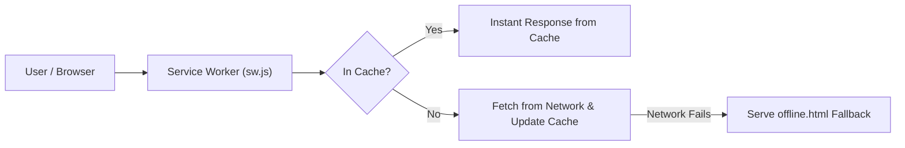

# DEV LOG: WEEK 40 - DAY 2

**Core Objective:** Implement the production Service Worker lifecycle, Web App Manifest, App Shell precaching, multi-strategy runtime caching, and a branded offline fallback page for TaskPulse PWA.

---

## 1. The Big Picture and Simple Explanation

A Service Worker acts as a programmable network proxy that sits quietly between the web browser and the internet. Whenever the web app requests a file or webpage, the Service Worker intercepts that request and decides whether to serve it instantly from the local cache or fetch it from the network.

Today, we transformed TaskPulse into a working, offline-ready Progressive Web App:
1. **Web App Manifest (`manifest.json`):** Configured app identity, standalone display mode, theme colors, and vector icons so modern browsers recognize TaskPulse as an installable application.
2. **App Shell Precaching:** During the Service Worker's `install` step, core UI assets (`index.html`, CSS stylesheets, JavaScript modules, and icons) are downloaded and stored in Cache Storage. When a user opens the app, it loads in under 100ms even without an internet connection.
3. **Multi-Tier Caching Strategies:**
   - **Cache-First for Static Assets:** CSS, JS, and SVG icons are served directly from cache for maximum speed.
   - **Network-First for HTML Pages:** The app attempts to fetch the newest page from the network; if offline, it serves the cached App Shell.
   - **Offline Fallback Page:** If an uncached URL is requested while offline, the Service Worker returns a clean, branded `offline.html` page with a retry button instead of a browser error.
4. **Live Connection Awareness:** Built real-time online/offline indicators so users always know their network state.

---

## 2. Key Modules and Features Implemented Today

### Web App Manifest & App Icon (`manifest.json` & `icon.svg`)
- Defined standalone display mode (`display: "standalone"`) to run in an app-like window without a browser address bar.
- Added dark theme (`#4f46e5`) and background color (`#0f172a`) for seamless splash screens.
- Created a crisp vector SVG app icon (`icon.svg`) with an indigo gradient badge and checkmark motif.

### Service Worker Engine (`sw.js`)
- **`install` Lifecycle:** Precaches the core App Shell assets into `taskpulse-static-v1` and calls `self.skipWaiting()` for immediate activation.
- **`activate` Lifecycle:** Automatically scans and deletes old cache buckets from previous versions to prevent cache bloat, then calls `clients.claim()`.
- **`fetch` Routing:** Routes HTML navigation requests, API calls, and static assets through appropriate caching strategies with offline resilience.

### Registration Coordinator (`src/swRegister.js`)
- Handles service worker registration and lifecycle events.
- Emits update notifications (`onUpdated`) when a new version of the app is waiting, allowing users to update with a single click.
- Binds global `online` and `offline` event listeners to notify components when network connectivity changes.

### Branded Offline Fallback (`offline.html`)
- Standalone HTML page with zero external dependencies, dark-mode styling, and an inline SVG offline beacon.
- Features a connection retry button and a direct link back to the cached TaskPulse workspace.

### UI App Shell & Network Beacon (`base.css`, `app.css`, `header.js`, `main.js`)
- Built dark-mode CSS tokens, sticky header, and dynamic banner stack.
- Added live network status beacon (`Online` in emerald, `Offline` in red).
- Implemented `beforeinstallprompt` event interception to show an "Install" button in the header when the app is eligible for installation.

---

## 3. Key Takeaways and Next Steps

- **Precaching Delivers Instant Boot Times:** Storing the App Shell locally makes web applications feel as responsive and reliable as native apps.
- **Always Provide an Offline Fallback:** Returning a branded fallback page instead of a generic browser error preserves user trust when connectivity drops.
- **Ready for Day 3:** With the Service Worker and caching foundation locked in place, Day 3 will focus on building the client-side transactional storage engine with **IndexedDB** (`idbManager.js`) for full offline task CRUD operations.
