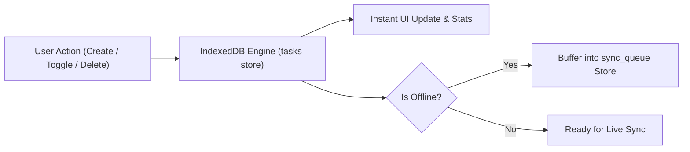

# DEV LOG: WEEK 40 - DAY 3

**Core Objective:** Build the zero-dependency IndexedDB storage engine (`idbManager.js`), offline mutation sync queue (`syncQueue.js`), task list component, and task creation modal for TaskPulse PWA.

---

## 1. The Big Picture and Simple Explanation

Many web developers rely on `localStorage` for quick data storage, but `localStorage` is synchronous, blocking, limited to only 5MB, and cannot store structured data with indexes. For a true offline-first Progressive Web App, **IndexedDB** is the browser standard. It is fully asynchronous, non-blocking, supports large storage quotas, and provides transactional integrity.

Today, we built the local storage foundation for TaskPulse:
1. **Local-First Speed:** Every action—creating a task, ticking off a checkbox, or deleting an item—writes directly to IndexedDB. The user interface updates instantaneously with zero network latency.
2. **Transactional Safety:** Using native IndexedDB transactions (`readwrite` and `readonly`), data operations are atomic and protected against corruption.
3. **Multi-Field Indexes:** We created indexes for `category`, `priority`, `completed`, and `updated_at`, allowing fast filtering without iterating through every record.
4. **Offline Sync Queue Buffer:** When mutations happen while disconnected, they are stored in a dedicated `sync_queue` store in IndexedDB so they can be replayed to the server as soon as the network returns.
5. **Storage Quota Awareness:** Integrated `navigator.storage.estimate()` to inspect real disk usage and percentage of available browser storage used.

---

## 2. Key Modules and Features Implemented Today

### IndexedDB Storage Engine (`src/storage/idbManager.js`)
- Created a zero-dependency Promise wrapper over raw IndexedDB events.
- Initialized database `taskpulse_db` with two dedicated object stores: `tasks` and `sync_queue`.
- Configured indexes for category filtering, completion status, and priority tags.
- Implemented full CRUD operations (`getAllTasks`, `getTaskById`, `saveTask`, `toggleTaskCompleted`, `deleteTask`).
- Added automatic starter seeding (`seedInitialTasksIfEmpty`) so new users immediately see helpful demo tasks on first boot.
- Added storage quota inspection (`getStorageQuota`) displaying formatted storage usage (KB/MB) and percentage used.

### Offline Sync Queue (`src/storage/syncQueue.js`)
- Built an append-only FIFO mutation buffer using IndexedDB's auto-incrementing key generator.
- Stores action type (`CREATE`, `UPDATE`, `DELETE`, `TOGGLE`), entity ID, payload snapshot, and ISO timestamp.
- Added helpers to count pending queue items, retrieve all mutations, and remove processed records.

### Task Grid & Modal Components (`src/components/taskGrid.js` & `taskModal.js`)
- **Task Grid:** Renders interactive task items with checkbox toggles, category badges (`work`, `personal`, `urgent`), priority indicators, and delete actions.
- **Task Modal:** Modal dialog for creating new tasks with title, optional description, category dropdown, and priority level.

### Application Orchestrator Updates (`src/main.js` & `app.css`)
- Wired task loading, category tab filtering, and instant counter updates (`Total Tasks`, `Pending`, `Offline Queue`).
- Added dark-theme modal styles with backdrop blur and smooth entrance transitions.
- Enhanced toast feedback service using clean CSS classes (`.toast-exit`) with zero inline styles.

---

## 3. Key Takeaways and Next Steps

- **Decouple UI from Network Latency:** Writing directly to IndexedDB gives web applications the same instantaneous responsiveness as native software.
- **Dedicated Sync Stores Prevent Data Loss:** Buffering offline mutations into a separate `sync_queue` store ensures that changes are never lost when the user closes their browser while offline.
- **Ready for Day 4:** With local persistence fully operational, Day 4 will implement the Background Sync Engine, network reconnection listeners, and automatic sync replay with the backend.
