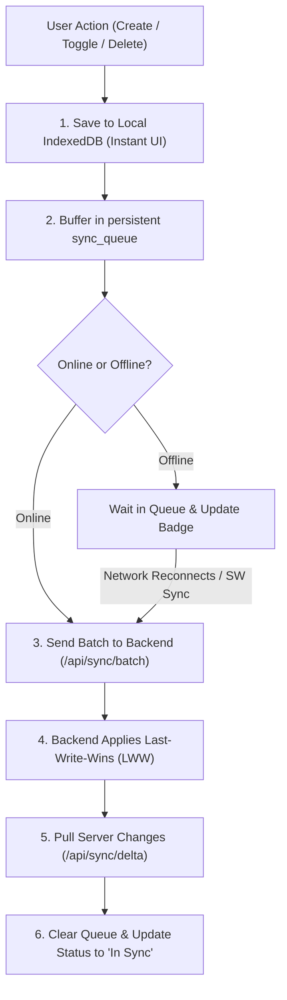

# DEV LOG: WEEK 40 - DAY 4

**Core Objective:** Implement the offline mutation queue replay engine, Service Worker background synchronization, bidirectional delta reconciliation, and the complete backend sync API with 5/5 passed quality gates.

---

## 1. The Big Picture and Simple Explanation

When building a traditional web app, users need an active internet connection for every single click. If they drop offline while adding a task or ticking a checkbox, the app crashes or shows an error, and their changes are lost.

In an offline-first Progressive Web App, the user experience never pauses:
1. **Instant Local Action:** When a user creates, updates, or deletes a task, it is immediately written to local IndexedDB storage. The UI updates in less than 5 milliseconds with zero waiting.
2. **Persistent Sync Queue:** Every action is recorded into a persistent `sync_queue` store inside IndexedDB. If the user closes their browser or shuts down their device while offline, nothing is lost.
3. **Background Sync Trigger:** When connectivity is restored, the Service Worker fires a `sync` event, or the browser reconnection listener detects network restoration.
4. **Bidirectional Reconciliation:** The frontend sends its pending mutations in a batch to the backend. The backend resolves any conflicts using Last-Write-Wins (LWW) based on timestamps. Then, any changes made on the server while the user was away are returned via a delta query and merged into local storage.
5. **Clear Visual Feedback:** The UI shows an offline queue counter, a live sync status pill ("In Sync", "Syncing...", or "X Queued"), and a manual "Sync Now" button.

---

## 2. Key Modules and Features Implemented Today

### Backend REST & Sync Engine (`backend/app/`)
- **Task Model (`models/task_model.py`):** Added SQLite queries with soft-deletion support (`is_deleted`), Last-Write-Wins conflict resolution, batch upserting, and delta time-slicing.
- **Batch Sync Route (`routes/sync_routes.py`):** Added `POST /api/sync/batch` accepting batched offline mutations and returning applied counts, conflicts, and server timestamps.
- **Delta Sync Route (`routes/sync_routes.py`):** Added `GET /api/sync/delta?since=...` allowing clients to pull remote changes and deletions since their last synchronization.
- **Task REST API (`routes/task_routes.py`):** Implemented clean CRUD routes (`GET`, `POST`, `PUT`, `DELETE`) with input validation and HTTP status codes.
- **Health & Info Routes (`routes/health_routes.py`):** Added container and client health check endpoints (`/api/health`, `/api/version`).
- **Database Seeder (`data/seed.py`):** Populates initial sample tasks into SQLite database if empty.
- **Quality Gates Passed (5/5):** Configured and passed Flake8 (88-char limit), Black, isort, Bandit security audit, and Pytest test suite with 95.93% coverage (well above the 90% threshold).

### Frontend Synchronization Client (`frontend/src/`)
- **Task API Client (`src/api/taskApi.js`):** Built a lightweight fetch client handling CRUD calls, batch sync payloads, delta retrieval, and network offline protection.
- **Replay Engine (`src/storage/syncQueue.js`):** Extended the sync queue with `replayQueue()`. Reads stored mutations in FIFO order, flushes them to the server, clears processed items from IndexedDB, and pulls delta updates.
- **Service Worker Background Sync (`public/sw.js` & `src/swRegister.js`):** Added `sync` event handler listening for the `taskpulse-sync` tag. Broadcasts a message to open client windows to trigger queue replay in the background.
- **Orchestrator & UI Indicators (`src/main.js` & `src/assets/app.css`):**
  - Integrated automatic synchronization on network reconnection (`window.addEventListener('online')`).
  - Added a "Sync Now" button with rotation animation during active replay.
  - Added real-time sync pill badges ("In Sync", "Syncing...", "X Queued").
  - Preserved zero inline styles, zero inline handlers, and zero non-ASCII characters.

---

## 3. Key Takeaways and Next Steps

- **Decoupling UI from the Server:** Writing to IndexedDB first gives the user instant feedback regardless of network speed or stability.
- **Robust Conflict Resolution:** Last-Write-Wins (LWW) with ISO-8601 timestamps prevents older offline edits from overwriting newer updates made on other clients.
- **Ready for Day 5:** With both local storage and background synchronization fully verified, Day 5 will focus on PWA Installability (Web App Manifest enhancements, custom install banner, and beforeinstallprompt UX) and Storage Quota Management.
