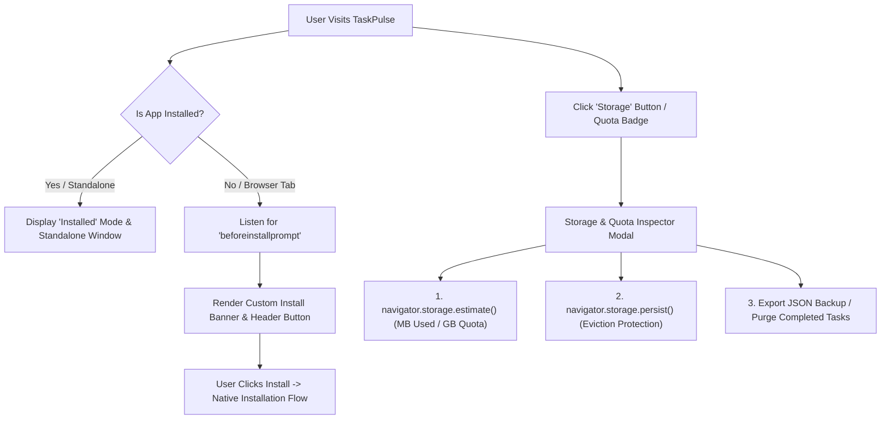

# DEV LOG: WEEK 40 - DAY 5

**Core Objective:** Implement PWA installability enhancements, custom install promotion banners, URL shortcut routing, and a dedicated Storage & Quota Inspector component (`storageInspector.js`) with persistent storage management and JSON backup export.

---

## 1. The Big Picture and Simple Explanation

Two core superpowers separate a true Progressive Web App from a regular website:
1. **Desktop & Mobile Installability:** A PWA does not stay trapped in a browser tab. Users can install it directly to their home screen, desktop, or dock. It opens in a standalone window without browser address bars, launches instantly, and feels like a native desktop app.
2. **Storage Quota & Eviction Protection:** Browsers can automatically wipe out local cache and IndexedDB storage when a device is low on disk space unless the app asks for **Persistent Storage**. A production PWA gives users full visibility into how much storage space is being used, lets them request eviction protection, and provides manual backup tools.

Today, we built both:
- **Custom Install Promotion:** Instead of relying only on browser mini-infobars, TaskPulse intercepts the `beforeinstallprompt` event and shows a custom install banner and header button. Once installed, it automatically switches to standalone mode and hides install prompts.
- **Storage & Quota Inspector:** A dedicated modal dialog that queries `navigator.storage.estimate()` and `navigator.storage.persisted()`. It displays a live visual quota meter, reveals the status of eviction protection, and gives users one-click backup exports and database maintenance tools.

---

## 2. Key Modules and Features Implemented Today

### Web App Manifest Enhancements (`frontend/public/manifest.json`)
- Added explicit PWA identifier (`id: "/taskpulse-pwa"`).
- Configured maskable and standard multi-size SVG icon declarations.
- Configured App Shortcuts:
  - `New Task` (`#new`): Instantly opens the task creation modal.
  - `Storage Inspector` (`#storage`): Instantly opens the storage quota inspector.

### Storage & Quota Inspector Component (`frontend/src/components/storageInspector.js`)
- **Real-Time Quota Meter:** Uses HTML5 semantic `<progress>` elements and `navigator.storage.estimate()` to calculate real disk space used (in MB) against available browser disk quota (in GB).
- **Eviction Protection Manager:** Detects if storage is granted persistent status via `navigator.storage.persisted()`. Allows users to request persistent storage with `navigator.storage.persist()`.
- **Database Breakdown Grid:** Displays live counts of Total Tasks, Pending Tasks, Completed Tasks, and queued offline mutations.
- **Maintenance Actions:**
  - **Export JSON Backup:** Generates and downloads a timestamped JSON file containing all user tasks.
  - **Purge Completed:** Deletes completed tasks from IndexedDB to free space while preserving pending work.
  - **Reset All Data:** Confirmation-protected reset clearing IndexedDB and restoring baseline demo tasks.
  - Preserved zero inline styles, zero inline handlers, and zero non-ASCII characters.

### Install Promotion & Application Orchestrator (`src/main.js` & `src/assets/app.css`)
- **Custom Install Banner:** Renders a dismissal-aware promo banner into the sticky header stack when the browser fires `beforeinstallprompt`.
- **Standalone Mode Awareness:** Checks `display-mode: standalone` and suppresses install prompts when already installed as a standalone app.
- **URL Hash Routing:** Added listeners for `#new` and `#storage` hash fragments, matching manifest shortcut entries.
- **Service Worker Precache Bump:** Added new modular components to the precache asset manifest and bumped cache version to `v2` in `sw.js`.

---

## 3. Key Takeaways and Next Steps

- **Transparency Builds Trust:** Giving users clear visibility into their local storage usage and offering manual JSON backup options gives them confidence that their offline data is safe.
- **Respect User Intent with Install Prompts:** Storing install banner dismissal in `sessionStorage` avoids annoying users who prefer running in a standard tab while still offering easy installation in the header.
- **Ready for Day 6:** With installability and storage management complete, Day 6 will implement Web Notifications (`notifications.js`) and push notification infrastructure for task reminders and sync alerts.
