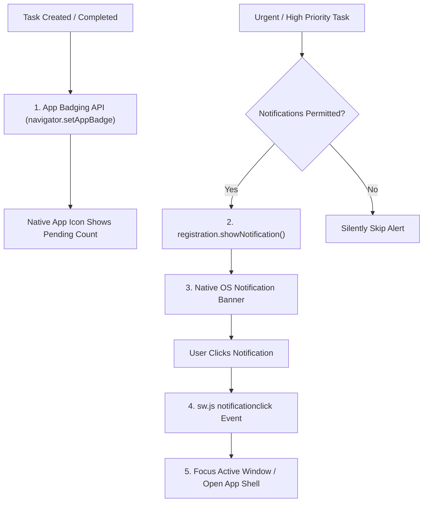

# DEV LOG: WEEK 40 - DAY 6

**Core Objective:** Implement the Web Notifications API wrapper, App Badging API synchronization for pending task counts, Service Worker notification click routing, and header alert toggles.

---

## 1. The Big Picture and Simple Explanation

A hallmark of high-quality native software is the ability to communicate with the user outside the browser window:
1. **System Tray & Lock Screen Alerts:** When a high-priority or urgent task is created, or when offline sync finishes, the app can display native operating system notifications via `NotificationService` and `ServiceWorkerRegistration.showNotification()`.
2. **Dynamic App Badging:** When installed to the Windows taskbar, macOS dock, or Android home screen, the app icon can display an unread count badge. TaskPulse uses the **App Badging API** (`navigator.setAppBadge()`) to keep the badge in sync with the user's pending task count in real time.
3. **Notification Click Routing:** Clicking on a system notification automatically brings the existing TaskPulse window into focus via the Service Worker's `notificationclick` handler, or launches a new window if the app was closed.

---

## 2. Key Modules and Features Implemented Today

### Notification Service (`frontend/src/utils/notifications.js`)
- **Permission Lifecycle:** Encapsulates `Notification.permission` checks and user permission requests (`requestPermission()`).
- **Service Worker Notification Dispatch:** Dispatches desktop/mobile notifications using `registration.showNotification(title, options)` with standard icon, badge, tags, and action buttons, falling back to window `Notification` when appropriate.
- **App Badging API Manager:** Wraps `navigator.setAppBadge(count)` and `navigator.clearAppBadge()`. Automatically sets the badge number when pending tasks exist and clears the badge when all tasks are complete.

### Service Worker Event Routing (`frontend/public/sw.js`)
- **Notification Click Handler (`notificationclick`):** Intercepts notification clicks, closes the notification, searches open client windows, and focuses the existing TaskPulse app window without reloading. If no window is open, it launches the app shell URL.
- **Push Notification Listener (`push`):** Supports incoming web push event payloads and displays notification alerts in the background.
- **Cache Asset Manifest:** Added `notifications.js` to the pre-cached static assets list and bumped cache version to `v3`.

### UI Integration & Header Alerts Toggle (`src/main.js`, `src/components/header.js`, `src/assets/app.css`)
- **Header Alerts Button:** Added an interactive notification toggle button in the header displaying current status (`Alerts On`, `Alerts`, or `Blocked`).
- **Priority Task Alert Triggers:** Dispatches a system notification whenever a new task with "urgent" or "high" priority is created.
- **Real-Time Badge Sync:** Updates the native app badge whenever task statistics refresh in `refreshTasks()`.
- **Zero Style Constraints Preserved:** Zero inline styles, zero inline event handlers, zero emojis, and zero non-ASCII characters.

---

## 3. Key Takeaways and Next Steps

- **Native Feel on Modern Desktops and Phones:** App badges and system notifications eliminate the distinction between a Progressive Web App and a traditional installed binary.
- **Graceful Fallbacks:** If a browser or OS does not support the App Badging API or if the user denies notifications, the application continues functioning smoothly with zero console errors.
- **Ready for Day 7:** With storage, background sync, installability, and notifications complete, Day 7 will focus on final verification, end-to-end user journey checks, Lighthouse PWA audit compliance, and documentation completion.
