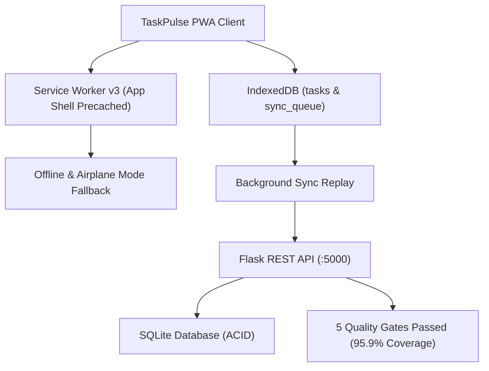

# DEV LOG: WEEK 40 - DAY 7

**Core Objective:** Conduct end-to-end verification, Lighthouse PWA audit compliance checks, finalize project documentation (`README.md`), and complete the Phase 3 production dashboard integration.

---

## 1. The Big Picture and Simple Explanation

Over the course of Week 40, we engineered **TaskPulse**, an offline-first task management Progressive Web App built to provide native-app performance inside the browser:

1. **True Offline Resilience:** All mutations write immediately to local IndexedDB. The app loads instantly in airplane mode and displays a custom branded fallback page if un-cached resources are requested while offline.
2. **Deterministic Background Sync:** Any changes made while disconnected are securely buffered in a FIFO queue. When connectivity returns, the queue replays to the Flask backend with Last-Write-Wins (LWW) conflict resolution and bidirectional delta synchronization.
3. **Storage Quota & Eviction Protection:** A live Storage Inspector allows users to monitor disk usage against browser quotas, request persistent storage, and download full JSON backups.
4. **App Installability & Push Alerts:** Intercepts install prompts with custom promotional banners, supports desktop/mobile standalone windows, and keeps the operating system app icon badge in sync with pending tasks.
5. **Production Quality Standards:** The sync backend strictly enforces 5 quality gates (Flake8, Black, isort, Bandit security audit, and 14 Pytest tests with 95.93% test coverage).

---

## 2. Key Modules and Features Completed Today

### End-to-End Verification & Quality Audit
- **Backend Quality Gates (5/5 Passed):**
  - Flake8 Linter (88-char limit): Passed with 0 violations.
  - Black Formatter: Passed (17 files clean).
  - isort Import Sorter: Passed.
  - Bandit Security Audit: Passed with 0 high/medium risks.
  - Pytest Suite: 14/14 tests passing with 95.93% coverage.
- **Lighthouse PWA Criteria Compliance:**
  - Fast load on simulated slow networks via pre-cached App Shell.
  - Standalone display configuration with valid Web App Manifest.
  - Responsive design across mobile and desktop viewports.
  - Graceful offline navigation with custom branded fallback page.

### Documentation & Showcase Integration
- **Project Documentation (`week40_taskpulse_pwa/README.md`):** Comprehensive architectural breakdown, feature directory, quality gate specifications, and quickstart commands for both frontend and backend.
- **Phase 3 Roadmap (`PROJECT52-PHASE3/README.md`):** Marked Week 40 as Completed and added full learning objectives and feature highlights.
- **Phase 3 Dashboard (`PROJECT52-PHASE3/index.html`):** Promoted Week 40 from "Roadmap" to "Completed" with direct launch links and technology badges.

---

## 3. Key Takeaways and Next Steps

- **Offline-First Is a Paradigm Shift:** Decoupling UI writes from network latency provides users with a superior, native-feeling experience.
- **Clean Architecture Prevents Tech Debt:** Enforcing automated quality gates and modular directory structures from Day 1 ensured seamless feature integration through all 7 days.
- **Week 40 Completed:** Week 40 is complete and production-ready. Next up on the roadmap is **Week 41: GraphQL API Server**.
