```mermaid
graph LR
    A[🌱 Weeks 1-12<br/>Foundation] -->|Build Skills| B[🔨 Weeks 13-36<br/>Integration]
    B -->|Master Stack| C[🚀 Weeks 37-52<br/>Production]
    
    style A fill:#1e1e2f,stroke:#61dafb,stroke-width:2px,color:#ffffff
    style B fill:#2c2c3e,stroke:#ff6f61,stroke-width:2px,color:#ffffff
    style C fill:#3a3a4d,stroke:#ffcc00,stroke-width:2px,color:#ffffff
```

# PROJECT52 - 2026 Challenge

> **One Project. Every Week. For 52 Weeks.**

[Phase 1: Foundation](https://github.com/pak-pow/PROJECT52-PHASE1) | [Phase 2: Integration](https://github.com/pak-pow/PROJECT52-PHASE2) | [Phase 3: Production](https://github.com/pak-pow/PROJECT52-PHASE3)

-----

## Overview

PROJECT52 is a structured, year-long software development initiative designed to facilitate the transition from beginner to production-ready Full Stack Developer. Starting January 2026, the roadmap mandates the creation of 52 projects, ranging from foundational scripts to deployed, scalable SaaS applications.

### Progression Philosophy

The curriculum is divided into three distinct phases, each building upon the complexity of the previous one.



**[Phase 1: Foundation](https://github.com/pak-pow/PROJECT52-PHASE1)** (Weeks 1-12)
*Focus: Mastering individual technologies, syntax, and core algorithmic concepts.*

**[Phase 2: Integration](https://github.com/pak-pow/PROJECT52-PHASE2)** (Weeks 13-36)
*Focus: Connecting frontend interfaces with backend logic and database systems.*

**[Phase 3: Production](https://github.com/pak-pow/PROJECT52-PHASE3)** (Weeks 37-52)
*Focus: Deployment, DevOps, testing, security, and scalability.*

-----

## Master Schedule: Weeks 1-52

### 📘 Phase 1: Foundation

**Duration:** January - March 2026

| Week | Project | Category | Skills | Est. Time |
|:----:|:--------|:---------|:-------|:---------:|
| 1 | Personal Portfolio Website v1 | Frontend | HTML5, CSS3, Responsive Design | 3h |
| 2 | Python CLI Task Manager | Python | File I/O, CLI Arguments | 2h |
| 3 | CSS Animation Showcase | Frontend | Keyframes, Transitions | 3h |
| 4 | Mathematical Visualization Tool | Python + Math | Matplotlib, NumPy | 4h |
| 5 | JavaScript Interactive Quiz | Frontend | DOM Manipulation, Events | 3h |
| 6 | Web Scraper for News | Python | BeautifulSoup, Requests | 4h |
| 7 | Landing Page (TailwindCSS) | Frontend | Utility-First CSS | 3h |
| 8 | Algorithm Visualizer | Python | Pygame, Sorting Algorithms | 5h |
| 9 | Form Validation Library | Frontend | JavaScript, Regex | 3h |
| 10 | Data Analysis Script | Python | Pandas, CSV Processing | 4h |
| 11 | Responsive Dashboard UI | Frontend | CSS Grid, Flexbox | 5h |
| 12 | Calculator with GUI | Python | Tkinter, OOP | 4h |

*For detailed Phase 1 documentation, visit the [Phase 1 Repository](https://github.com/pak-pow/PROJECT52-PHASE1).*

-----

### 🔨 Phase 2: Integration

**Duration:** April - September 2026

| Week | Project | Category | Skills | Est. Time |
|:----:|:--------|:---------|:-------|:---------:|
| 13 | REST API for Todo App | Backend | Flask/FastAPI, RESTful Design | 5h |
| 14 | Todo Frontend (Fetch API) | Frontend | AJAX, API Integration | 4h |
| 15 | User Authentication System | Backend | JWT, Hashing, Sessions | 6h |
| 16 | Blog Platform (Static) | Frontend | Multi-page Layout, SEO | 4h |
| 17 | SQLite Database Manager | Backend | SQL Queries, CRUD | 5h |
| 18 | Weather Dashboard | Full Stack | External APIs, Async JS | 5h |
| 19 | Markdown Note-Taking App | Full Stack | File System, Parsers | 6h |
| 20 | E-commerce Product Catalog | Full Stack | Models, Filtering, Search | 7h |
| 21 | Real-time Chat App | Full Stack | WebSockets, Event-Driven | 8h |
| 22 | Blog with CMS Backend | Full Stack | Admin Panel, Rich Text | 7h |
| 23 | Expense Tracker | Full Stack | Chart.js, Aggregation | 6h |
| 24 | URL Shortener Service | Backend | Hash Functions, DB Design | 5h |
| 25 | Recipe Sharing Platform | Full Stack | Image Upload, User Content | 8h |
| 26 | Kanban Board (Trello Clone) | Full Stack | Drag & Drop, State Mgmt | 9h |
| 27 | Portfolio v2 with Backend | Full Stack | Contact Forms, Dashboard | 7h |
| 28 | Quiz Platform with Scores | Full Stack | Leaderboards, Logic | 7h |
| 29 | File Upload System | Backend | File Handling, Cloud Storage | 6h |
| 30 | Social Media Feed | Full Stack | Infinite Scroll, Likes | 8h |
| 31 | Booking System | Full Stack | Calendar Logic, Availability | 9h |
| 32 | API Rate Limiter | Backend | Redis, Algorithms | 6h |
| 33 | Multi-user Drawing Canvas | Full Stack | Canvas API, Real-time Sync | 8h |
| 34 | Job Board Platform | Full Stack | Search Filters, Applications | 9h |
| 35 | Notification System | Backend | Email/SMS, Queues | 7h |
| 36 | Analytics Dashboard | Full Stack | Visualization, Metrics | 8h |

*For detailed Phase 2 documentation, visit the [Phase 2 Repository](https://github.com/pak-pow/PROJECT52-PHASE2).*

-----

### 🚀 Phase 3: Production

**Duration:** October - December 2026

| Week | Project | Category | Skills | Est. Time |
|:----:|:--------|:---------|:-------|:---------:|
| 37 | CI/CD Pipeline Setup | DevOps | GitHub Actions, Testing | 6h |
| 38 | Containerized App | DevOps | Docker, Compose | 7h |
| 39 | E-commerce Store v1 | Full Stack | Payments, Cart Logic | 10h |
| 40 | Progressive Web App | Frontend | Service Workers, Offline | 8h |
| 41 | GraphQL API Server | Backend | GraphQL, Schemas | 8h |
| 42 | Collaborative Editor | Full Stack | OT/CRDT, WebRTC | 10h |
| 43 | Video Streaming Platform | Full Stack | HLS, Video Processing | 10h |
| 44 | ML Model API | Backend | Model Serving | 9h |
| 45 | Mobile-First SaaS App | Full Stack | Responsive, Subscriptions | 10h |
| 46 | OAuth Provider Service | Backend | OAuth 2.0, Security | 9h |
| 47 | Microservices Arch. | Backend | Service Comm, Load Balancing | 10h |
| 48 | Full-Featured Blog | Full Stack | Advanced SEO, Search | 10h |
| 49 | Stock Trading Dashboard | Full Stack | Live Data, WebSockets | 10h |
| 50 | Automated Testing Suite | DevOps | Unit/Integration/E2E | 8h |
| 51 | Production E-commerce v2 | Full Stack | Inventory, Orders, Admin | 12h |
| 52 | SaaS Product Launch | Full Stack | Deployment, Launch | 15h |

*For detailed Phase 3 documentation, visit the [Phase 3 Repository](https://github.com/pak-pow/PROJECT52-PHASE3).*

-----

## Skills Analytics

The project distribution ensures a balanced approach to full-stack mastery:

```text
Frontend Development    : 16 projects (31%)
Backend Development     : 14 projects (27%)
Full Stack Applications : 17 projects (33%)
DevOps & Deployment     : 5 projects (9%)
```

-----

## Directory Structure

The project ecosystem is organized as follows:

```
PROJECT52/
├── README.md (This Document)
├── PROJECT52-PHASE1/ (Linked Submodule or Repository)
│   ├── week-01-portfolio/
│   └── ...
├── PROJECT52-PHASE2/ (Linked Submodule or Repository)
│   ├── week-13-todo-api/
│   └── ...
└── PROJECT52-PHASE3/ (Linked Submodule or Repository)
    ├── week-37-cicd-pipeline/
    └── ...
```

-----

## Success Metrics

To consider the PROJECT52 challenge successfully completed, the following criteria must be met:

  - [ ] Completion of all 52 projects within the calendar year.
  - [ ] Deployment of at least 15 projects to a public URL.
  - [ ] Creation of a production-ready portfolio.
  - [ ] Demonstration of mastery across Frontend, Backend, and DevOps.
  - [ ] Comprehensive documentation of learnings and challenges.
  - [ ] Contribution to Open Source by Week 52.

-----

**Challenge Start:** January 1, 2026\
**Challenge End:** December 31, 2026\
**Total Commitment:** \~354 Hours

> "The expert in anything was once a beginner who refused to give up."
