## 🎯 PROJECT52 - 2026 Challenge

> **One Project. Every Week. For 52 Weeks.**

A year-long commitment to mastering Full Stack Development through deliberate, progressive practice. Starting January 2026, I'm building 52 projects that span the entire development spectrum—from foundational Python scripts to production-ready full-stack applications.

### 📈 Progression Philosophy

```mermaid
graph LR
    A[🌱 Weeks 1-12<br/>Foundation] -->|Build Skills| B[🔨 Weeks 13-36<br/>Integration]
    B -->|Master Stack| C[🚀 Weeks 37-52<br/>Production]
    
    style A fill:#1e1e2f,stroke:#61dafb,stroke-width:2px,color:#ffffff
    style B fill:#2c2c3e,stroke:#ff6f61,stroke-width:2px,color:#ffffff
    style C fill:#3a3a4d,stroke:#ffcc00,stroke-width:2px,color:#ffffff
```



**Phase 1: Foundation (Weeks 1-12)** - Master individual technologies and core concepts  
**Phase 2: Integration (Weeks 13-36)** - Connect frontend, backend, and databases into cohesive systems  
**Phase 3: Production (Weeks 37-52)** - Build scalable, deployed applications with best practices

---

### 🗓️ Complete 52-Week Breakdown

#### 📘 Phase 1: Foundation (Weeks 1-12)

**Focus:** Individual skill building, syntax mastery, and fundamental patterns

| Week | Project | Category | Skills | Time |
|------|---------|----------|--------|------|
| 1 | Personal Portfolio Website v1 | Frontend | HTML5, CSS3, Responsive Design | 3h |
| 2 | Python CLI Task Manager | Python | File I/O, CLI Arguments, Data Structures | 2h |
| 3 | CSS Animation Showcase | Frontend | Keyframes, Transitions, Transforms | 3h |
| 4 | Mathematical Visualization Tool | Python + Math | Matplotlib, NumPy, Functions | 4h |
| 5 | JavaScript Interactive Quiz | Frontend | DOM Manipulation, Event Listeners | 3h |
| 6 | Web Scraper for News Headlines | Python | BeautifulSoup, Requests, Data Parsing | 4h |
| 7 | Landing Page with TailwindCSS | Frontend | Utility-First CSS, Component Design | 3h |
| 8 | Algorithm Visualizer (Sorting) | Python + Math | Pygame, Algorithm Implementation | 5h |
| 9 | Form Validation Library | Frontend | JavaScript Functions, Regex | 3h |
| 10 | Python Data Analysis Script | Python | Pandas, CSV Processing, Statistics | 4h |
| 11 | Responsive Dashboard UI | Frontend | CSS Grid, Flexbox, Media Queries | 5h |
| 12 | Calculator with GUI | Python | Tkinter, Event Handling, OOP | 4h |

---

#### 🔨 Phase 2: Integration (Weeks 13-36)

**Focus:** Connecting technologies, building APIs, database integration, and system design

| Week | Project | Category | Skills | Time |
|------|---------|----------|--------|------|
| 13 | REST API for Todo App | Backend | Flask/FastAPI, RESTful Design | 5h |
| 14 | Todo Frontend with Fetch API | Frontend + Backend | AJAX, API Integration, JSON | 4h |
| 15 | User Authentication System | Backend | JWT, Password Hashing, Sessions | 6h |
| 16 | Blog Platform (Static) | Frontend | Multi-page Layout, SEO Basics | 4h |
| 17 | SQLite Database Manager | Backend + Database | SQL Queries, CRUD Operations | 5h |
| 18 | Weather Dashboard with API | Full Stack | External APIs, Async JS, UI Updates | 5h |
| 19 | Markdown Note-Taking App | Full Stack | File System, Markdown Parser | 6h |
| 20 | E-commerce Product Catalog | Frontend + Backend | Product Models, Filtering, Search | 7h |
| 21 | Real-time Chat Application | Full Stack | WebSockets, Event-Driven Design | 8h |
| 22 | Blog with CMS Backend | Full Stack | Admin Panel, Rich Text Editor | 7h |
| 23 | Expense Tracker with Charts | Full Stack | Chart.js, Data Aggregation | 6h |
| 24 | URL Shortener Service | Backend | Hash Functions, Database Design | 5h |
| 25 | Recipe Sharing Platform | Full Stack | Image Upload, User Content | 8h |
| 26 | Kanban Board (Trello Clone) | Full Stack | Drag & Drop, State Management | 9h |
| 27 | Portfolio v2 with Backend | Full Stack | Contact Forms, Admin Dashboard | 7h |
| 28 | Quiz Platform with Scores | Full Stack | Leaderboards, Timed Tests | 7h |
| 29 | File Upload & Storage System | Backend | File Handling, Cloud Storage | 6h |
| 30 | Social Media Feed | Full Stack | Infinite Scroll, Like System | 8h |
| 31 | Booking/Reservation System | Full Stack | Calendar Logic, Availability | 9h |
| 32 | API Rate Limiter Middleware | Backend | Redis, Token Bucket Algorithm | 6h |
| 33 | Multi-user Drawing Canvas | Full Stack | Canvas API, Real-time Sync | 8h |
| 34 | Job Board Platform | Full Stack | Search Filters, Application System | 9h |
| 35 | Notification System | Backend | Email/SMS Integration, Queues | 7h |
| 36 | Analytics Dashboard | Full Stack | Data Visualization, Metrics | 8h |

---

#### 🚀 Phase 3: Production (Weeks 37-52)

**Focus:** Deployment, scalability, testing, DevOps, and production-grade applications

| Week | Project | Category | Skills | Time |
|------|---------|----------|--------|------|
| 37 | CI/CD Pipeline Setup | DevOps | GitHub Actions, Automated Testing | 6h |
| 38 | Containerized App with Docker | DevOps | Docker, Docker Compose | 7h |
| 39 | E-commerce Store v1 | Full Stack | Payment Integration, Cart Logic | 10h |
| 40 | Progressive Web App (PWA) | Frontend | Service Workers, Offline Mode | 8h |
| 41 | GraphQL API Server | Backend | GraphQL, Schema Design | 8h |
| 42 | Real-time Collaborative Editor | Full Stack | Operational Transform, WebRTC | 10h |
| 43 | Video Streaming Platform | Full Stack | HLS, Video Processing | 10h |
| 44 | Machine Learning Model API | Backend + ML | TensorFlow/PyTorch, Model Serving | 9h |
| 45 | Mobile-First SaaS App | Full Stack | Responsive Design, Subscriptions | 10h |
| 46 | OAuth Provider Service | Backend | OAuth 2.0, Security Standards | 9h |
| 47 | Microservices Architecture | Backend + DevOps | Service Communication, Load Balancing | 10h |
| 48 | Full-Featured Blog Platform | Full Stack | SEO, Comments, Tags, Search | 10h |
| 49 | Real-time Stock Trading Dashboard | Full Stack | WebSockets, Live Data, Charts | 10h |
| 50 | Automated Testing Suite | DevOps | Unit/Integration/E2E Tests | 8h |
| 51 | Production E-commerce v2 | Full Stack | Inventory, Orders, Admin Panel | 12h |
| 52 | Personal SaaS Product Launch | Full Stack + DevOps | Everything Combined, Deployment | 15h |

---

### 📊 Skills Distribution

```
Frontend Development    : 16 projects (31%)
Backend Development     : 14 projects (27%)
Full Stack Applications : 17 projects (33%)
DevOps & Deployment     : 5 projects (9%)
```

### 🎓 Learning Resources

**Frontend:**
- MDN Web Docs, CSS-Tricks, JavaScript.info
- FreeCodeCamp, Frontend Mentor challenges

**Backend:**
- FastAPI Documentation, Flask Mega-Tutorial
- SQL Tutorial (W3Schools), PostgreSQL Exercises

**Full Stack:**
- Full Stack Open (University of Helsinki)
- The Odin Project, roadmap.sh

**DevOps:**
- Docker Documentation, GitHub Actions Docs
- DigitalOcean Tutorials

---

### 📝 Tracking Progress

| Status | Meaning |
|--------|---------|
| 🔴 | Not Started |
| 🟡 | In Progress |
| 🟢 | Completed |
| ⭐ | Deployed Live |

**Repository Structure:**
```
PROJECT52/
├── week-01-portfolio/
│   ├── README.md
│   ├── src/
│   └── demo.gif
├── week-02-task-manager/
└── ...
```

---

### 🎯 Success Metrics

- ✅ Complete all 52 projects on time
- ✅ Deploy at least 15 projects live
- ✅ Build a portfolio of production-ready work
- ✅ Master the full development stack
- ✅ Document learnings and challenges
- ✅ Contribute to open source by Week 52

---

**Challenge Start Date:** January 1, 2026  
**Challenge End Date:** December 31, 2026  
**Commitment Level:** 🔥🔥🔥 Maximum

> "The expert in anything was once a beginner who refused to give up."

---
